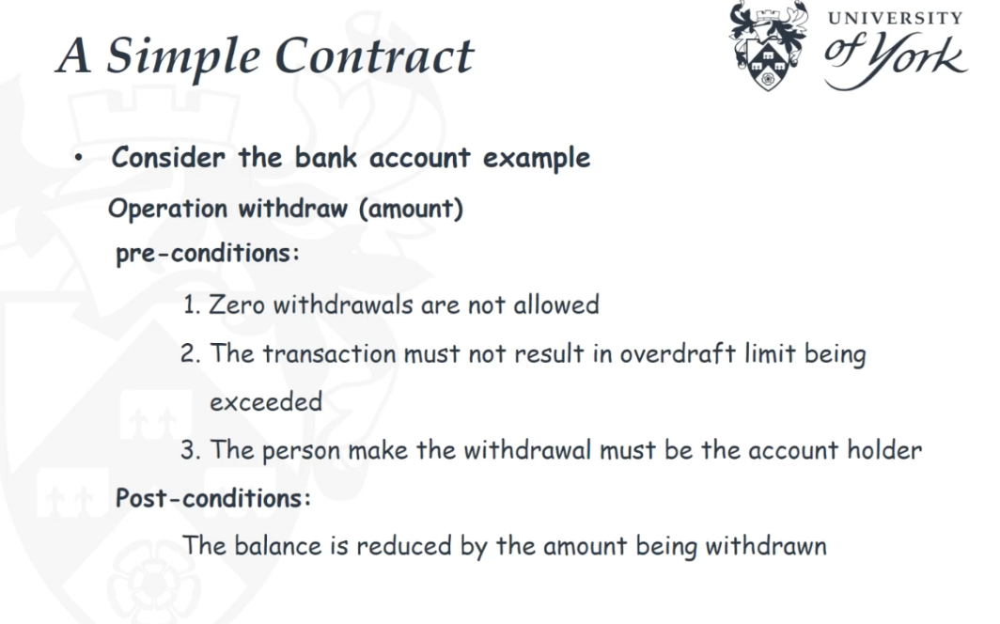
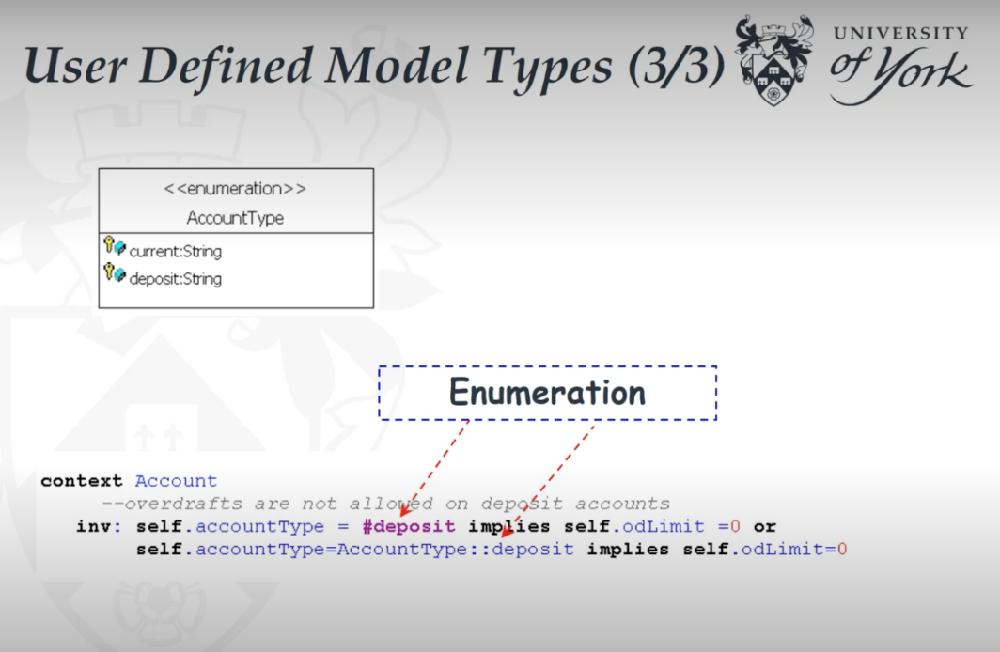
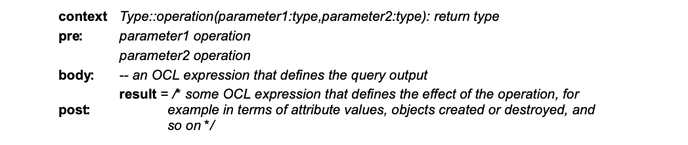
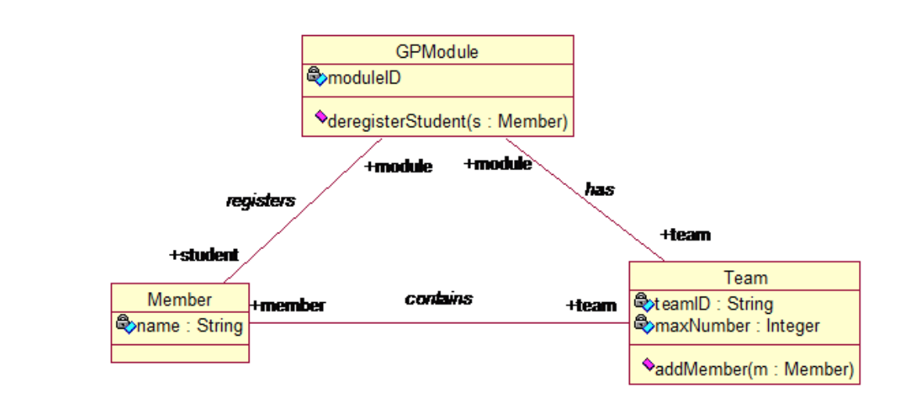
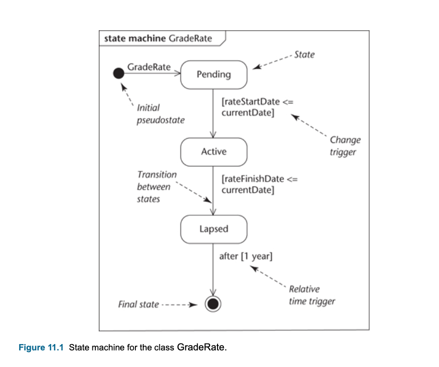
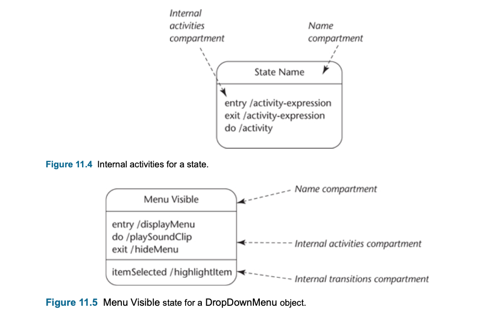
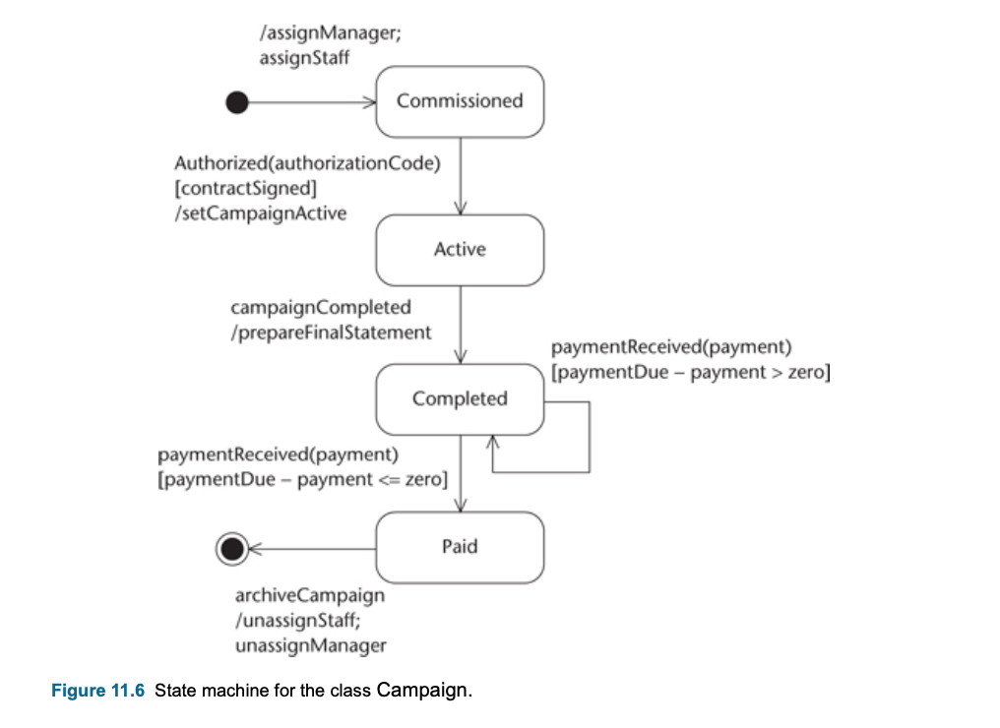
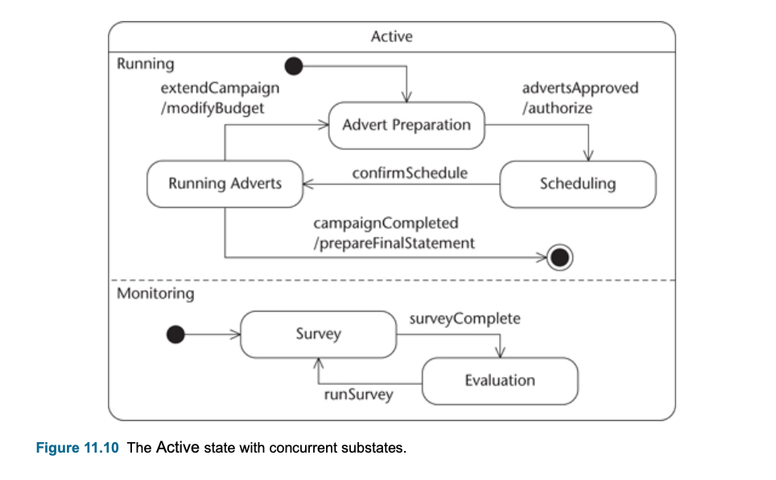
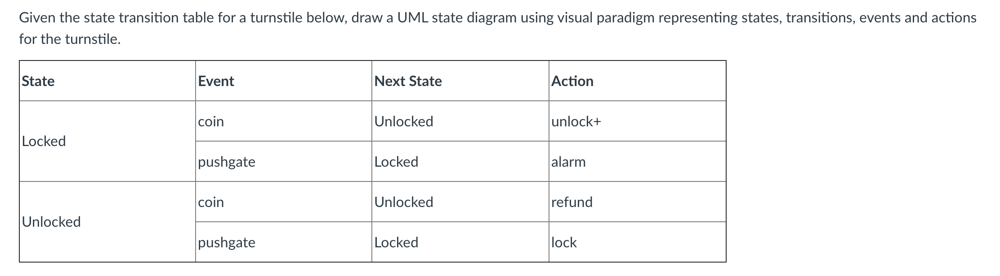
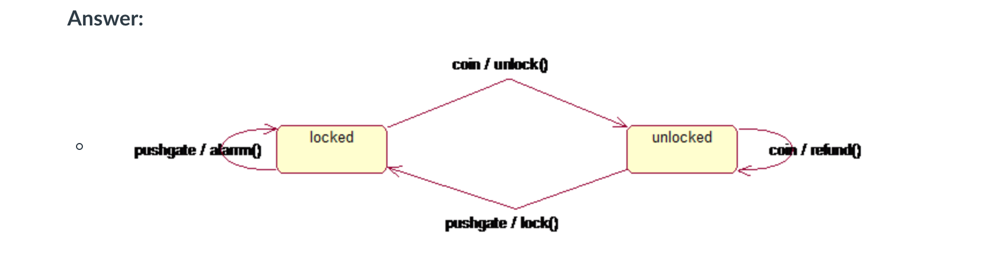

#### Main Topics

1) Specify constraints and operations for a class diagram using OCL <br>
2) Model state related behaviour using state machines <br>

Relevant module learning outcomes for this week:

* Investigate and analyse a problem, write a software requirement specification and design blueprint expressed in UML
  which provides a basis for code generation

#### Title

* Lesson 1 : Operation specification with natural language
* Lesson 2 : Operation specification with OCLE
* Lesson 3 : State modelling

#### Sub titles:

* [Operation specification](#operation-specification)
    * [Describing Operation logic](#describing-operation-logic)
        * [Non-algorithmic approaches - declarative](#non-algorithmic-approaches-declarative)
        * [Algorithmic approaches - procedural](#algorithmic-approaches-procedural)
* [Object constraint language (OCL)](#object-constraint-language-ocl)
    * [OCL Keywords](#ocl-keywords)
    * [Examples](#examples)
        * [Bank Account](#bank-account)
        * [Campaign](#campaign)
        * [Person](#person)
        * [Crate](#crate)
* [State Machines](#state-machines)
    * [State Modelling](#state-modelling)
    * [Notation](#notation)
    * [Preparing a State Machine](#preparing-a-state-machine)
        * [Behavioural Approach](#a-behavioural-approach)
        * [Lifecycle Approach](#a-lifecycle-approach)
    * [Questions](#questions-for-state-machine)
* [Summary](#summary)
* [Sources](#sources)

# Operation specification

* Specify what an operation should do.
    * Operation specifications describe the detailed behaviour of the system.
* The two general ways of doing this are respectively called ‘algorithmic’ (or ‘procedural’) and ‘non-algorithmic’ (or
  ‘declarative’).
* Some common technics :
    * White box: (How)
        * Structured English or Pseudo-Code
        * Activity Diagram
    * Black box: (What)
        * Pre and post-condition pairs
            * Pre-conditions: condition must be true before an operation execute
            * Post-condition: Result of an operation after its execution

* **Analysis by contract** is a preferred approach for object oriented development
    * Typically written as pre and post condition pairs:
    * Focus on **what** the operation should achieve (a black box approach) rather than **how** the operation should
      work (a white box approach).



* Two main purposes of an operation specification
    * From an analysis perspective, an operation specification is created at a point when the analyst’s understanding of
      some aspect of an application domain can be fed back to users, ensuring that the proposals meet users’
      requirements.
    * From a design perspective, an operation specification is a basis for a more detailed design specification, which
      later guides a programmer to a method that is an appropriate implementation of the operation in code. An operation
      specification can also be used to verify that the method does indeed meet its specification, which in turn
      describes what the users intended, thus checking that the requirements have been implemented.
* Specification by contract means that operations are defined primarily in terms of the services they deliver, and the
  input they receive (usually just the operation signature).

## Describing Operation Logic

* There are 2 ways:
    * Non-algorithmic approaches (declarative):
    * Algorithmic approach (procedural):

### Non-algorithmic approaches (declarative):

* A non-algorithmic approach concentrates on describing the logic of an operation as a black box.
* Why generally preferred in OO world:
    * First, the implementation of a class should be hidden from the rest of the system and thus only the designers and
      programmers responsible for a particular class need concern themselves with internal implementation details.
    * Second, process carried out by any one operation is simple, it does not require a complex specification.
* 2 types :
    * **Decision table:**
        * is a matrix that shows the conditions under which a decision is made, the actions that may result and how the
          two are related
        * Situations that require non-algorithmic specification of logic, reflecting a range of alternative behaviours
    * **Pre and post-condition:**
        * any operation specification must pass the following two tests.
            * A user should be able to check that it correctly expresses the business logic.
            * A class designer should be able to produce a detailed design of the operation for a programmer to code.


### Algorithmic approaches (procedural)

* An algorithm describes the internal logic of a process or decision by breaking it down into small steps, and sequence
  of steps
* 4 types :
    * **Control structures in algorithms:**
        * Algorithms are generally organized procedurally, which is to say that they use the fundamental programming
          control structures of sequence, selection and iteration
    * **Structured English :**
        * This is a ‘dialect’ of written English that is about halfway between everyday non-technical language and a
          formal programming language.
        * 3 type control structure:
            * if-then-else
            * nested if (case)
            * iteration
                * do while : ending the repetition tested before
                * repeat until: ending the repetition tested after
    * **Pseudo-code:**
        * Pseudo-code differs from Structured English in that it is closer to the vocabulary and syntax of a specific
          programming language
        * pseudo-code remains only a skeleton of a program, intended only to illustrate its logical structure without
          including full design and implementation detail
    * **Activity diagrams**
        * Activity diagrams can be used to specify the logic of procedurally complex operations

# Object constraint language (OCL)

* For any OCL expression, you need to specify the context. The context of an invariant is normally a class.
* An invariant means a property of a model element is always true.
    * The example specifies the invariant that a customer should be no less than 18 years old.
* Pre- or Post-conditions is always an operation
    * **pre** **and** post are the keywords
* OCL is used to specify invariants of objects and pre- and post conditions of operations. Makes UML (class)
  diagrams more precise.
* OCL is an excellent tool for formally specifying the constraints and operation contracts that cannot be expressed in a
  UML model, e.g. class diagrams.
* OCL expressions use vocabulary of UML class diagram. OCL is a pure expression language with its expressiveness in
  terms of UML object models.
* OCL attribute accesses “navigate” through UML class diagram.
* Queries (= side-effect-free operations) can be used in OCL
  expressions.

### **OCL keywords:**

* context :  specifies about which elements we are talking.
* inv
* pre - post
* self : keyword is similar to the keyword this in Java.
* @pre : indicates the value of an attribute or association at the start of the execution of the operation. @pre can
  only be used in a post-condition expression.
* result : is similar to the return statement in Java
* and - or - not
* implies,
* if - then - else - endif

#### **OCL Data types**

* Real: *, +, -, * , /,  >=, <=, >, <
* Integer : *, +, -, * , /,  >=, <=, >, <
* String : size()
* Boolean : and - or - not, implies, if - then - else - endif

#### **OCL arithmetic operators**

* +, -, * and /

#### **OCL comparison operators**

* <, > =, <=, >,

#### **String operation**

* size

#### **OCL Set operators**

* size():integer
* isEmpty()
* notEmpty()
* select(Boolean Expression): collection : returns sub collection for a given condition
* count(object): integer
* sum()
* exists(Boolean Expression): Boolean : checks whether there exist any elements that satisfy a condition
* forAll(Boolean Expression): Boolean : checks whether there for all elements that satisfy a condition
* includes(object):Boolean
* excludes(object):Boolean : not yet
* including(object):collection : to add
* excluding(object):collection
* collect(a property):collection : returns different collection of the property

#### **OCL type operators**

* oclIsTypeOf : operation to check whether an object is a particular type as specified in the parameter. For example, in
  the Context of Customer, the self object should be of type of Customer so a truth value is expected to be returned.

#### **Properties on a class diagram**

* classes,
* attributes,
* association roles
* query operations
* Enumeration type

#### **Navigator**

* Dot notation .
* Association-ends by navigations: The result of navigation is either a model or a collection of a model types

#### **Notation for collection feature call**

* Arrow ->
    * A property of the collection itself is accessed by using an arrow ‘->’ followed by the name of the property

```
context
Person
inv:
    self.employer->size() < 3 
```

#### **Comment notation**

* Double hyphen

#### Logic

* True OR-ed with anything is True
* False AND-ed with anything is False
* False IMPLIES anything is True
* anything IMPLIES True is True




## Examples

```
// -- Invariants
context Company
inv: self.numberOfEmployees > 50

context c:Company
inv: c.numberOfEmployees > 50

context c:Company
inv enoughEmployees: // -- named invariant
    c.numberOfEmployees > 50

// -- Pre and Post conditions
context Person::income(d:Date):Integer
post: result = 5000

context Person::income(d:Date):Integer
pre: d > 2000
post: result = 5000

context Person::income(d:Date): Integer // -- with optional condition names
pre: parameterOK: d > 2000
post: resultOK: result = 5000

// -- Let Expression :The let expression allows one to define a variable which can be used in the constraint.

context Person
inv: let income: Integer = self.job.salary->sum() in
    if isUnemployed then
        income < 100
    else
        income >= 100
    endif

// Combine Props
// [1] Married people are of age >= 18
context Person
inv:
    self.wife-> notEmpty() implies self.wife.age >= 18 and 
    self.husband->notEmpty() implies self.husband.age >= 18

// [2] a company has at most 50 employees
context Company
inv:
    self.employee->size() <= 50

```


### Pre- Post  constraints



### Properties: AssociationEnds and Navigation

* Starting from a specific object, we can navigate an association on the class diagram to refer to other objects and
  their properties.
* To do so, we navigate the association by using the opposite association-end:
    * ```object.associationEndName```
* The value of this expression is the set of objects on the other side of the associationEndName association.
    * If the multiplicity of the association-end has a maximum of one (“0..1” or “1”), then the value of this expression
      is an object.
* By default, navigation will result in a Set. When the association is adorned with {ordered}, the navigation results in
  an OrderedSet.
* When the name of an association-end is missing at one of the ends of an association, the name of the type at the
  association end starting with a lowercase character is used as the rolename.

```
context
Company
inv: self.manager.isUnemployed = false // -- self.manager is a Person, because the multiplicity of the association is one
inv: self.employee->notEmpty()  // -- is a set
```

### Iterate Operation

* The operations **reject, select, forAll, exists, collect,** can all be described in terms of iterate. An accumulation
  builds one value by iterating over a collection.
    * ``` collection->iterate( elem : Type; acc : Type = <expression> | expression-with-elem-and-acc ) ```

```
collection->collect(x:T | x.property)
// -- is identical to:
collection->iterate(x:T ;acc : T2 = Bag{} | acc->including(x.property))


self.employé->select(age > 50)
self.employé->select(p | p.age > 50)
self.employé->select(p:Personne | p.age > 50)
self.enfants->forall(age < 10)
self.enfants->exists(sexe = Sexe::Masculin)


// The complete select syntax now looks like one of:
    collection->select(v:Type | boolean - expression -with-v) 
    collection->select(v | boolean - expression -with-v)
    collection->select(boolean - expression)

```


```
// A vehicle owner must be at least 18 years old
context Vehicle
inv: self.owner.age >=18

// A car owner must be at least 18 years old
context Car
inv: self.owner.age >=18

// Nobody has more than 3 vehicles
context Person
inv: self.fleet -> size() <=3

// All cars of a person are black
context Person
inv: self.fleet -> forAll(v | v.colour = #black)

// Nobody has more than 3 black vehicles
context Person
inv: self.fleet- select(v | v.colour= #black)-> size()<=3

context Person
inv: self.fleet–>iterate(v; acc:Integer=0
    | if (v.colour=#black)
    then acc + 1 else acc endif) <=3

// A person younger than 18 owns no cars.”
context Person
inv: age<18 implies self.fleet–>forAll(v | not v.oclIsKindOf(Car))

// These is a red car
context Car
inv: Car.allInstances()->exists(c | c.colour=#red)

// Apply operations
// “If setAge(. . . ) is called with a non-negative argument then the argument becomes the new value of the attribute age
context Person::setAge(newAge:int)
pre: newAge >= 0
post: self.age = newAge

// Calling birthday() increments the age of a person by 1.
context Person::birthday()
post: self.age = self.age@pre + 1

// Calling getName() delivers the value of the attribute name.
context Person::getName()
post: result = name
```

### Bank Account


```
// CUSTOMER
context Customer
//--Test comparison operator
inv: (firstName<>lastName) <>  (firstName=lastName)

//--oclIsTypeOf
inv: self.oclIsTypeOf(Customer)

//-- Navigation result is a collection
inv: self.heldAccount->size()<=5

//-- Query operation
inv: self.getAge()>=18

//--Query operation with brackets omittted
inv: self.getAge>=18

//--Customer should have at least one account with balance more than 200
inv: self.heldAccount -> select (balanceEnquiry()>200) ->notEmpty or
self.heldAccount -> exists (balanceEnquiry()>200)

//--Customer should have all accounts with balance more than 200
inv: self.heldAccount -> forAll (balanceEnquiry()>200)

//-- A customer can have no more than 5 accounts
//-- Navigation result is a collection
inv: self.heldAccount->size()<=5

/* Customer must be no less than 18 years old*/
inv: age>=18

inv: self.age>=18

//-- The sum of a Customer balance for all accounts should be no less than 10
inv: self.heldAccount->collect(balanceEnquiry())->sum>=10

/* Customer must be no less than 18 years old*/
inv: age>=18
inv: self.heldAccount->collect(balanceEnquiry())->sum>=1000

context Customer::addAccount(account:Account)
// --the person shouldn't already own the account
pre: not heldAccount->includes(account)
//--the acount is owned by the new customer and account is added to the customer
post:(account.holder = self) and
heldAccount = heldAccount@pre->including(account)

// ACCOUNT
context Account
//-- An account can only have one holder
inv zero: self.holder->size = 1

//-- overdraft limit may not exeed
inv one: 	self.balance >= -self.odLimit

//-- customer under 18 years of age are not allowed overdrafts
//-- Navigation result is a query operation
inv two: 	self.holder.getAge()<= 18 implies self.odLimit =0

//--overdrafts are not allowed on deposit accounts
inv three: 	self.accountType = #deposit implies self.odLimit =0 or
self.accountType=AccountType::deposit implies self.odLimit=0


context Account::deposit(depType: DepositType, amount:Integer)
//-- zero deposits are not allowed
//-- the deposit must be applied to the right account
pre:	amount>0 and accessor = holder
// --if the amount deposited is in cash,
// --if is added to the balance; if it is a cheque, it is added to the uncleared amount
post:	(depType=#cash implies self.balance = balance@pre + amount) or
(depType=#cheque implies self.uncleared = uncleared@pre + amount)


context Account::withdraw(amount:Integer)
//--zero withdrawals are not allowed
//--the transaction must not result in the overdraft limit being exceeded
//--the person making the withdrawal must be the account holder
pre:amount>0 and
balance-amount>= -odLimit and
accessor = holder
//--the balance is reduced by the amount withdrawn
post:balance = balance@pre-amount


context Account::balanceEnquiry():Integer
//--balance details may only be given to the holder of the account
pre: accessor = holder
//--the balance is returned
post: result = balance


context Account::availableFunds():Integer
//--details of funds available may only be given to the holder of the account
pre: accessor = holder
//--the available fund are calculated from the current balance and the customer's overdraft limit
post: result = balance + odLimit


context Account::clear(amount:Integer)
//--you cannot clear more than the cleared amount
pre: uncleared>=amount
//--the cleared amount is subtracted from the uncleared amount
//--the balance is increased by the cleared amount
post: (uncleared = uncleared@pre + amount) and
(balance = balance@pre + amount)

```

### Campaign

```

context Campaign
inv: self.estimatedCost=self.advert.getEstimatedCost()->sum() *(1 + ohRate)

context Campaign::upDateEstimatedCost()
post:
if self.estimatedCost > estimatedCost@pre and
    self.estimatedCost>budget and
    self.estimatedCost<= budget*1.02
then self.clientLetterRequired= 'true'
else self.clientLetterRequired = 'false'
endif

context Campaign::checkCampaignBudget():Real
pre: self<> 'null'
post: result=self.budget-self.estimatedCost and
self.estimatedCost=self.advert.getEstimatedCost()->sum()


context CreativeStaff::changeGrade(grade:Grade, gradeChangeDate:Date)
pre: grade.oclIsTypeOf(Grade)and
gradeChangeDate.isNotEarlierThan(today)
post: self.staffGrade->notEmpty and
self.staffGrade.previous->notEmpty and
self.staffGrade.getGradeStartDate()=gradeChangeDate and
self.staffGrade.previous.getGradeFinishDate()=gradeChangeDate.minus(1)

```

### Person

```
context Person
inv: self.gender=Gender::male or self.gender=Gender::female
inv: self.savings>=500
inv: self.husband->notEmpty() implies self.husband.gender=Gender::male
context Company
inv: self.CEO->size()<=1
inv: self.employee->select(self.employee.getAge<60)->size()<100N
```

### Crate

```
context Crate
// -- the number of bottles may not exceed its capacity
inv: bottles->size()<=capacity
// --each bottle must fit in the crate
inv: bottles->forAll (b|b.getDiameter<self.maxDiameter)
// -- the total weight must be less than the maximum
inv: totalWeight() <= maxWeight
// -- totalWeight() is derived
inv: totalWeight() = self.bottles.totalWeight()->sum() + self.weight

context Crate::addBottle( b : Bottle )
// -- there must be room in the crate
pre: bottles->size() < capacity
// -- the maximum weight for the crate may not be exceeded
pre: totalWeight() + b.totalWeight() <= maxWeight
// -- the bottle is not yet in the crate
pre: bottles->excludes(b)
// --the bottle is added successfully>br/>  
post: bottles = bottles@pre->including(b)
```



```
// There are two pre-requisites for a GPModule team: the number of members on a team should be no more than maxNumber and a team ID should contain no more than 10 characters.
context Team 
inv f1: member->size()<=maxNumber
inv f2: teamID.size()<=10

// The operation addMember is used to allocate a member to a team. It has two pre-requisites that the member does not belong to any team and the team cannot exceed a maximum number limit by adding the member. It has one post-requisite that the member is successfully allocated to the team.
context Team::addMember(m:Member)
pre: m.team->size()=0 and
     member->size()<maxNumber
post: member->includes(m)

// The operation deregisterStudent is used to deregister a student when a student quits a module. It has one pre-requisite that the student must be one of the students who is registered to the module. It has two post-requisites that the student is not registered with the module and the student is removed from his/her team.
context GPModule::deregisterStudent(s:Member)
pre:student->includes(s)
post:student->excludes(s) and s.team->size()=0


```

## Exam Questions

### 2018


```
// 1 [8 marks] There are two pre-requisites for a mortgage: 
// i) the age of the borrower must be no less than 18 and no more than 65 years old and 
// ii) the borrower of a mortgage on a house must be the owner of the house.
context Mortgage
inv f1: self.borrower.getAge()>=18 and  self.borrower.getAge()<=65
inv f2: self.borrower = self.house.owner

//2. [12 marks] The operation getMortgage is used to access a mortgage for a borrower. 
// It has two pre-requisites: i) a minimum deposit of 5% of the house’s value is needed for a mortgage and 
// ii) by receiving the mortgage the total amount of the borrower’s mortgage will not exceed five times of his/her salary. It has one post-requisite that the mortgage is successfully granted to the applicant.
context Person::getMorgage(m: Morgage,d: deposit)
pre: self.home.getPrice() * 0.05 <= d and
    self.morgage.getAmount()->sum() + m.getAmount() < self.salary * 5
post: self.morgage->includes(m)

//3. [10 marks] The operation sellHouse is used for a house owner to sell his house. It has
// one pre-requisite that the house in question belongs to the owner. It has two post-
// requisites: i) the house is successfully sold and ii) the mortgage for the house is removed from the house owner.
context Person::sellHouse(h: House)
pre: self.house->includes(h)
post: self.house->excludes(h) and
    self.morgage.house->excludes(h)

```

### 2017


```
// 1. [8 marks] There are two pre-requisites for a module: the moduleID should contain exactly four characters and the number of students on each module must be at least 10.
context Module
inv f1: self.moduleId.size()=4
inv f2: self.student->size()>=10


// [12 marks] The operation registerModule is used to register a student to a module. It has two pre-requisites: that the student must not already be registered to that module; and the student has paid for the fees. It has one post-requisite: that the student is successfully registered.
context Student::registerModul(mod : Module)
pre: self.module->excludes(mod) and
    self.feesPaid=true
post: self.module->includes(mod)

//  [10 marks] The operation passModule is used to update student credits earned when they pass 	a module. It has one pre-requisite: that the module must be one of the modules the student has been registered to. It has one post-requisite: that the creditsEarned now held in the object Student must be equal to the previous credit with the credit of this module added into the total.
context Student::passModule(mod: Module)
pre: self.module->includes(mod)
pro: self.creditEarned= self.creaditEarn@pre + mod.getCredit()

```

# State Machines

* State Machine models one class, how it responds to all the events that affect it.
* All objects have a state, and it determines the value of the object attribute value.
* A state occupies for a period of time
* Not all events cause a state-change
* Object performs a different action for the same event depending on the object's state.
* State modelling can help to identify the operations that are required
* To model state related behaviour, UML state machines are used.
* A state machine is a description of all the possible lifecycles that an object of a class might follow
    * State machines model one class, how it responds to all the events that affect it
    * It can also be seen as a more detailed view of a class.



## State Modelling

* Collect together all events, from all sequence diagrams, for one class.
* The first step is to check the classes with heavy messaging.
* Examine which one cause state change and result states,
* This gives us first cut state chart with a few states and events.
* We should revise accordingly the class diagram.
* Needs to check always:
    * Every event should appear as an incoming message for the appropriate object on an interaction diagram (s).
    * Every event should correspond to an operation on the appropriate class (but note that not all operations
      correspond to events).
    * Every action should correspond to the execution of an operation on the appropriate class.
* In sequence diagram , we can see the objects on top as participant and messages are events.

## Notation

* Initial pseudostate : starting point, indicated by a small solid filled circle
    * This is only a notational convenience. An object cannot remain in its initial pseudo state, but must immediately
      move into another named state
* Final state : final state, is shown by a bull’s-eye symbol.
    * This too is a notational convenience and an object cannot leave its final state once it has been entered.
* State :
* Transition : Movement from one state to another, and is initiated by a trigger.
* Trigger : is an event that can cause a state change
    * When its triggering event occurs a transition is said to fire
    * A transition is shown as an open arrow from the source state to the target state.
* Change trigger : occurs when a condition becomes true,This is usually described as a Boolean expression (true/false).
  First and last transitions does not have this.
    * This form of conditional event is different from a guard condition, which is normally evaluated at the moment that
      its associated event fires.
* Call trigger : occurs when an object receives a call for one of its operations, either from another object or from
  itself
    * Call triggers correspond to the receipt of a call message and are annotated by the signature of the operation as
      the trigger for the transition.
* Signal trigger : occurs when an object receives a signal
    * As with call triggers the event is annotated with the signature of the operation invoked.
    * There is no syntactic difference between call triggers and signal triggers, It is assumed that a naming convention
      is used to distinguish between them.
    * **A call trigger is a normal message, a signal trigger is an asynchronous message**
* Relative time trigger : is caused by the passage of a designated period of time after a specified event (frequently
  the entry to the current state)
    * Relative time triggers are shown by time expressions near the transitions.
* Guard condition (Guard) : is a Boolean expression that is evaluated at the time the trigger fires
    * The transition only takes place if the guard condition evaluates to true
    * A guard condition is a constraint that may involve parameters of the trigger, attributes or links of the object
      that owns the state machine.
    * A guard is shown in square brackets—‘[‘...’]’.
    * [contractSigned] is a guard condition in example
* Activity-expression : is executed when a trigger causes the transition to fire
    * begins with the ‘/’ delimiter character
    * setCampaignActive is example
    * activity-expression with multiple actions
        * **left-mouse-down(location) [validItemSelected] / menuChoice = pickMenuItem(location); menuChoice.highlight**
* Action : are considered to be atomic (that is, they cannot be subdivided) and cannot be interrupted once they have
  been started
    * ‘run-to- completion’ : Once initiated this action must execute fully before any other action is considered
    * What does an action start with /

<br>


* The name compartment holds the name of the state. States may be unnamed and anonymous.
* State internal activity : The internal activities compartment lists the internal activities or state activities that
  are executed in that state
    * State activities may ‘persist’ for a period of time, perhaps the duration of the state
    * Three kinds of internal event have a special notation.
        * Entry activities and the exit activities
            * These cannot have guard conditions as they are invoked implicitly on entry to the state and exit from the
              state respectively.
            * may also involve parameters of incoming transitions (provided that these appear on all incoming
              transitions) and attributes and links of the owning object
            * It is important to emphasize that any transition into a state causes the entry activity to fire and all
              transitions out of a state cause the exit activity to fire.
            * **‘entry’ ‘/’ activity-name ‘(’ parameter-list ‘)’**  and  **‘exit’ ‘/’ activity-name ‘(’ parameter-list
              ‘)’**
    * do activity
        * **‘do’ ‘/’ activity-name ‘(’ parameter-list ‘)’**
* Internal transition : compartment lists internal transitions.
    * Each of these transitions is described in the same way as a trigger.
    * Internal transitions do not cause a state change and do not invoke the exit or entry activities.
* Vertex: Each node in a state machine diagram

<br>



* Composite states : is the state that has several substates, nested states.
    * A single state that contains a nested state diagram within it known as **submachine**
    * Submachine syntax : state name ‘:’ reference-state-machine–diagram-name
* Concurrent states : as a product of two (or more) distinct sets of substates, each state of which can be entered and
  exited independently of substates in the other set.
    * Splitting the state into two concurrent nested submachines.
* Synchronised concurrent states
* A **fork** pseudostate splitting the transition into two paths, each leading to a specific concurrent substate. It
  also shows that the containing state is not exited until both parallel nested submachines are exited with transitions
  that merge at the **join** pseudostate.


## Preparing a State Machine

* Use case diagram -->  interaction diagrams (sequence diagrams or communication diagrams) --> state machines
* The lifecycle approach is less formal than the behavioural approach

### A behavioural approach

* The initial source of the behaviour approach is **interaction diagrams**
*
    1. Examine all interaction diagrams that involve each class that has heavy messaging.
*
    2. For each class for which a state machine is being built follow steps 3 to 9.
*
    3. On each interaction diagram identify the incoming messages that may correspond to events for the class being
       considered. Also identify the possible resulting states.
*
    4. Document these events and states on a state machine.
*
    5. Elaborate the state machine as necessary to cater for additional interactions as these become evident, and add
       any exceptions.
*
    6. Develop any nested state machines (unless this has already been done in an earlier step).
*
    7. Review the state machine to ensure consistency with use cases. In particular, check that any constraints that are
       implied by the state machine are appropriate.
*
    8. Iterate steps 4, 5 and 6 until the state machine captures the necessary level of detail.
*
    9. Check the consistency of the state machine with the class diagram, with interaction diagrams and with any other
       state machine

### A lifecycle approach

* This approach does not use interaction diagrams as an initial source of possible events and states. Instead, they are
  identified directly **from use cases** and from any other requirements documentation that happens to be available.
*
    1. Identify major system events.
*
    2. Identify each class that is likely to have a state dependent response to these events.
*
    3. For each of these classes produce a first-cut state machine by considering the typical lifecycle of an instance
       of the class.
*
    4. Examine the state machine and elaborate to encompass more detailed event behaviour.
*
    5. Enhance the state machine to include alternative scenarios.
*
    6. Review the state machine to ensure that it is consistent with the use cases. In particular, check that the
       constraints that the state machine implies are appropriate.
*
    7. Iterate through steps 4, 5 and 6 until the state machine captures the necessary level of detail.
*
    8. Ensure consistency with class diagram and interaction diagrams and other state machines.

## Questions for State Machine

*
    1. What is the difference between a call trigger and a signal trigger?

    * A call trigger is a normal message, a signal trigger is an asynchronous message
*
    2. What does an action start with?

    * /
*
    3. When there is more than one action, what are the actions separated by?

    * ;
*
    4. Does internal transition cause state change?

    * No
*
    5. Does internal transition invoke exit and entry activity?

    * No
*
    6. For a state with internal activities, any transition into the state causes which activity to fine?

    * Entry
*
    7. For a state with internal activities, any transition out of the state causes which activity to fine?

    * Exit
* All of them correct !
    * A transition to a state with concurrent substates means simultaneously entering the concurrent substates.
    * A transition out of a composite state applies to all its substates (no matter how deeply nested).
    * The use of the join pseudostate means that the composite state is not exited until both concurrent nested state
      machines are exited.

### Activity

 <br>


# Summary

* Operation specifications are the most detailed description of the behaviour of a system model. As such, they are also
  one of the more significant elements in the project repository. They provide an important link between the system’s
  users, who typically possess a detailed understanding of the required system behaviour, and the designers and
  programmers who must implement this in software. Accurate specification of operations is essential if the software is
  to be coded correctly.
* In this chapter we introduced the ‘contract’ as a framework for specifying operations, in terms of the service
  relationship between classes. Contracts are a particularly useful element of operation specification since they
  concentrate on the correctness of each object’s behaviour.
* We also described several techniques for describing operation logic. Non-algorithmic techniques, such as decision
  tables and pre- and post-condition pairs, take a black box approach and concentrate on specifying only the inputs to
  an operation (its pre-conditions) and the intended results of an operation (its post-conditions). In many cases,
  particularly where the operations themselves are simple, this is all the specification that a programmer needs to code
  the operation correctly. Algorithmic techniques, such as Structured English, pseudo-code and activity diagrams, take a
  white box approach, and this means that they concentrate on defining the internal logic of operations. These
  techniques are particularly useful when an operation is computationally complex. They are also useful when we need to
  model some larger element of system behaviour, such as a use case, that has not yet been decomposed to the level of
  individual operations that can be assigned to specific classes.
* Many elements of an operation specification can be written in OCL (UML’s Object Constraint Language). OCL is intended
  for use as a formal language for specifying constraints and queries on an object model, and this includes operation
  pre- and post-conditions and invariants.

* **State machine summary is missing.**

# Examples

* [1](https://modeling-languages.com/wp-content/uploads/2012/03/OCLChapter.pdf)
* [2](http://www.inf.ed.ac.uk/teaching/courses/seoc/2015_2016/tutorials/exerciseWk9.pdf)
* [3](http://www-sop.inria.fr/members/Charles.Andre/CAdoc/ESINSA/UMLOCL-memo.pdf)

# Sources

[OCLE](http://lci.cs.ubbcluj.ro/ocle/) <br>
[Ocla Specofocation OMG](https://www.omg.org/spec/OCL/2.4/PDF) <br>
[Introduction to OCLA](https://formal.iti.kit.edu/~beckert/teaching/Verification-SS06/10OCL.pdf) <br>
[OCL Cheat Sheet](https://scribetools.readthedocs.io/en/latest/_downloads/UMLOCL-CheatSheet-18.pdf)

[State Machine Diagram Tutorial](https://online.visual-paradigm.com/diagrams/tutorials/state-machine-diagram-tutorial/) <br>


