#### Main Topics

1) Assess software architecture patterns and applicable situations <br>
2) Produce a design class model <br>
3) Apply design pattern to teh class design <br>

Relevant module learning outcomes for this week:<br>

* Investigate and analyse a problem, write a software requirement specification and design blueprint expressed in UML
  which provides a basis for code generation,
* Apply a range of design patterns and principles to solve particular design problems

#### Sub titles:

* [Intro](#intro)
    * [12 Quality Criteria For Good Design.](#12-quality-criteria-for-good-design)
* [High-level design](#high-level-design)
    * [Criteria for package design](#criteria-for-package-design)
    * [Software architecture patterns](#software-architecture-patterns)
        * [Closed Architecture](#closed-architecture)
        * [Open Architecture](#open-architecture)
        * [Repository Architecture](#repository-architecture)
        * [Client-server Architecture](#client-server-architecture)
        * [Peer to peer architecture (P2P)](#peer-to-peer-architecture-p2p)
        * [Broker architecture](#broker-architecture)
        * [MVC (Model-View-Controller)](#mvc-model-view-controller)
* [Low Level](#low-level-design)
    * [Criteria for good class design](#criteria-for-good-class-design)
    * [Attributes and operation specification](#attributes-and-operation-specification)
    * [Designing associations and constraints](#designing-associations-and-constraints)
    * [Constraints Design](#constraints-design)
* [Software design patterns](#software-design-patterns)
    * [GOF Design Patterns (Gang of four)](#gof-design-patterns-gang-of-four)
        * [Creational Pattern](#creational-pattern)
            * [Singleton](#singleton)
        * [Structural Pattern](#structural-pattern)
            * [Composite Pattern](#composite-pattern)
        * [Behavioral Pattern](#behavioral-pattern)
            * [strategy PAttern](#strategy-pattern)
* [Questions](#questions)

# Intro

* **Analysis** is often said to be about the **What?** of a system, **Design** described as being about the **How?**
    * The models that are produced by design activities show how the various parts of the system will work together; the
      models produced by analysis activities show what is in the system and how those parts are related to one another"
* Analysis means in Greek, break down in peaces.
    * Analysis activity characterized as asking while analysing; what happened in current system and what is required to
      new system
    * Analyse activity results is specification of what the system will do based on the requirements.
* Design is "how the system will be constructed without actually building it’.
    * Design is about producing a solution that meets the requirement that have been analysed.

* Seamlessness of object oriented approach is that the same model (the class diagram or object model) is used right
  through the life of the project
    * Analysis identifies classes, those classes are refined in design, and the eventual programs will be written in
      terms of classes
* The first is _implementation-independent_ or **logical design** and the second is _implementation-dependent_ or **
  physical design.**
* The OMG promotes an initiative called Model-Driven Architecture (MDA).
    * This approach is based on the idea that a system can be modelled in UML to create a platform-independent model (
      PIM), and that this PIM can then be transformed using automated modelling and programming tools into a
      platform-dependent model (PDM) for a specific platform.
    * The same PIM can be translated into many different PDMs for different platforms.

* System design is concerned with the design of the components of the system and the setting of standards: for example,
  for the design of the human–computer interface. Within the constraints of the enterprise architecture and the system
  architecture, the system designer chooses appropriate technologies and sets standards that will be used across the
  system. Design patterns can be used in system architecture, system design and detailed design, but the choice of
  patterns that will be used in the implementation is most relevant to system design.
    * During system design the designers make decisions that will affect the system as a whole.The most important aspect
      of this is the overall architecture of the system.
* Detailed design is concerned with designing individual elements to fit the architecture, to conform to the standards
  and to provide the basis for an effective and efficient implementation. In an object-oriented system, the detailed
  design is mainly concerned with the design of objects and classes. Detailed design also addresses the user interface
  and database design.
    * Detailed design has been about designing inputs, outputs, processes and file or database structures; these same
      aspects of the system also have to be designed in an object- oriented system, but they will be organized in terms
      of classes.

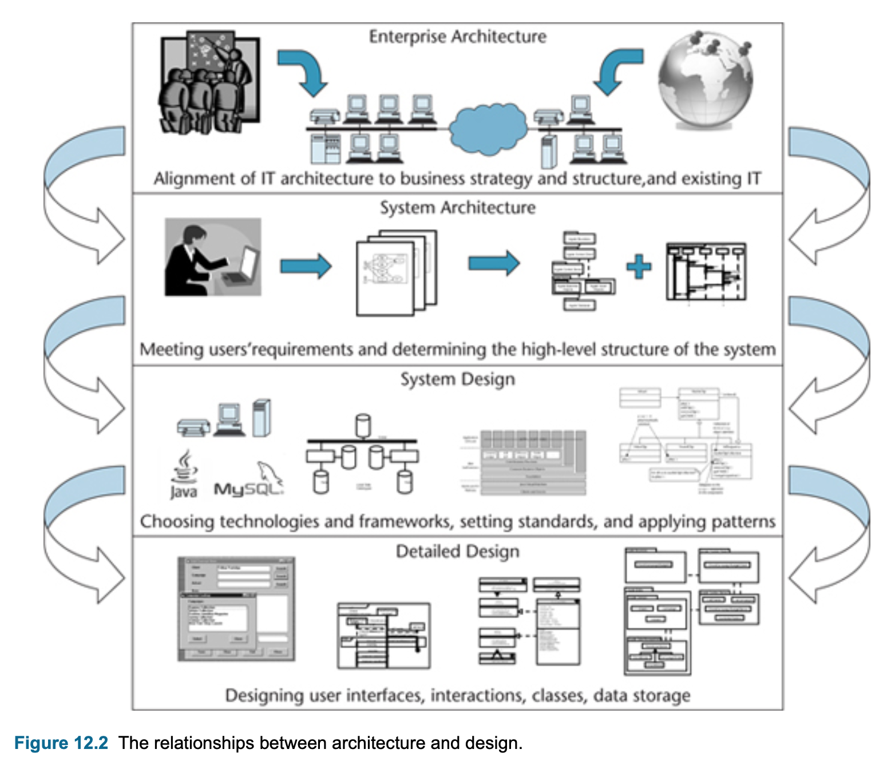

# 12 Quality Criteria For Good Design

* **Functional** is the system performs the functions that are expected to work correctly and completely.
* **Efficient** means the functionality needs to efficiently in terms of time and resources (optimal solution)
* **Economical** applies not only to the fixed costs of the hardware and software that will be required to run it, but
  also to the running costs of the system.
* **Reliable** must be in 2 ways
    * Hardware & software failure
    * Integrity of the data in the system
* **Secure** system needs to design against malicious attack by outsiders and against unauthorized use by insiders.
* **Flexible** is the ability of the system to adapt to changing business requirements as time passes.
* **General** describes the extent to which a system is general-purpose
* **Buildable** is the clear and not unnecessarily complex design in programmer perspective.
* **Manageable** design allows the project manager to estimate the amount of work involved in implementing the various
  subsystems.
* **Maintainable** is about making maintenance easy and cheaper. Maintenance is cited as taking up as much as 60% of the
  data-processing budget of organizations and maintenance programmers spends up to 50% their time to understand the
  code.
* **Usable** is about to design system user-friendly, enjoyable and reducing error rates made by user.
* **Reusable** is to improve possibility of reuse, It has 3 ways
    * considering of inheritance to improve reuse
    * looking for opportunities to use design patterns
    * seeking to reuse existing classes or components either directly or by subclassing them.

# High-level design

* High-level design concerns the big picture of the system
* There are 2 extremes:
    * One object that does everything. Any attributes and operations are all bundled together like a lump of spaghetti
    * Having to many objects, Everything is ‘decomposed’, and each object has perhaps one attribute and one domain
      method
* Abstractions are levels at which you operate mentally.
* Package is a general-purpose mechanism for organising elements into related groups, e.g grouping class together
* Package provides levels of abstraction to software system.
* Package in the UML helps:
    * To group elements
    * To provide a namespace for the grouped elements
    * A package may contain other packages, thus providing for a hierarchical organization of packages.
    * UML elements can be grouped into packages.
* A dependency exist between two classes if changes to the definition of one class may cause changes to the other.
* A dependency between two packages exist if any dependency exists between any 2 classes in the packages.
* Here is 4 pachages has dependency each other, eg, Business has a dependency to Database.


## Criteria for package design

* When a package changes, all packages depend on it needs to change or rebuild.
* Coupling is the independent measure of package/classes.
    * The more independent a package is, the more robust it is to changes.
* Package cohesion refers to interfaces and classes within a package that fulfil a similar purpose, service or function.
    * Package relational cohesion (or package internal coupling) can be quantified using the formula:
        * RC=numberOfInternalRelations/numberOfTypesm, RC=3/4=0.75 where 3 is the number of messages between classes and
          4 is the total number of classes within the package
        * The bigger RC is the higher cohesion
* Desigred good design is low coupling and hight cohesion.

## Software Architecture Patterns

* The purpose of architecture patterns is re-use
* Packages are general purpose mechanism for organizing elements into groups.
* Subsystems have clearly defined responsibilities, behaviour to do the real work
    * flagged with <<subsystem>>
* Issues and Approaches in SW Arhitecture design :
    * Considering decomposing via vertical layering and horizontal portioning.
    * Communication protocols between subsytems with strong encapsulation via an API
    * The overall control flow for a particular event might dominate the design and can use Event driven arch?

### Closed Architecture

* Each layer depend on one layer below.
* 3-5 layer is typical
* Advantage: Low coupling
* Disadvantage: Each layer introduce a speed & storage overhead. e.g bottleneck


### Open Architecture

* higher layer can access any layer below
* Advantage: This can avoid performance bottlenecks.
* Disadvantage: it suffers the penalty of increased coupling due to extra dependencies.

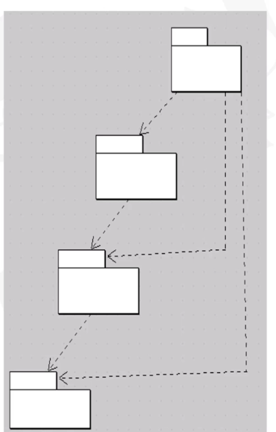

### Repository Architecture

* This is a system that allow several interfacing components to share the same data.
* Advantage : Easy to add a subsystem
* Disadvantage: Repository can be a bottleneck due to excessive queue requests.
  

### Client-server architecture

* Multiple client requests and receive service from a centralized host server.
* Client needs to know server, but server does not know the client. Server wont effect any client changes by this way.
  

### Peer to peer architecture (P2P)

* Commanly use in network architecture in which each subsystem has the same capabilities and responsibilities. eg multi
  agent apps
* Disadvantages: introduces more coupling and control flow hazards, so it is more difficult to implement and maintain
  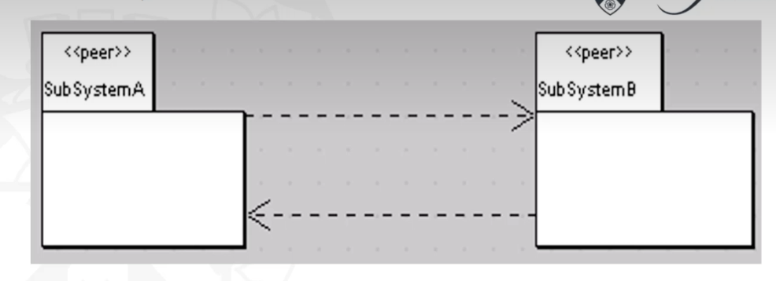

### Broker architecture

* Client does not need to know where the server, client communicate with broker and broker knows where server is. e.g.
  in a distributed ecommerce system

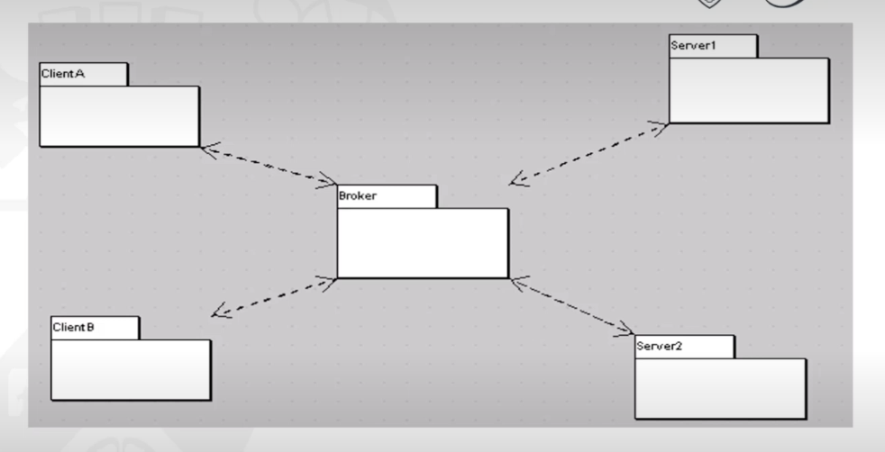

### MVC (Model-View-Controller)

* Separate app in 3 components:
    * Model : Represent data and business logic
    * View: represent UI
    * Controller: handles user request
* MVC suitable for apps that has multiple views for a single data source
* Views register with Models and when modal change , propogation process will notify all views to change.
* Modal is independent from View and Controller, only needs to say "I've changed"
* The propagation mechanism reduces the package coupling to some extent.
* The responsibilities of the components of an MVC architecture are listed below.
  * Model. The model provides the central functionality of the application and is aware of each of its dependent view and controller components.
  * View. Each view corresponds to a particular style and format of presentation of information to the user. The view retrieves data from the model and updates its presentations when data has been changed in one of the other views. The view creates its associated controller.
  * Controller. The controller accepts user input in the form of events that trigger the execution of operations within the model. These may cause changes to the information and in turn trigger updates in all the views ensuring that they are all up to date.
  * Propagation mechanism. This enables the model to inform each view that the model data has changed and as a result the view must update itself. It is also often called the dependency mechanism.

<br>

[10 Common architecture](https://towardsdatascience.com/10-common-software-architectural-patterns-in-a-nutshell-a0b47a1e9013)

<br>

# Low-level design

* Low-level design concerns the input, output, processes and files or database structure
* Low level design activities involve:
    * Designing the entity classes in the analysis model including attributes, associations and operations.
    * Adding control classes using one for every use case as a general rule
    * Adding boundary classes, e.g. Java AWT or Java Swing or JGoodies packages for the GUI
    * Do the target relational databases support the ODBC standard? If so, can use Java Database Connectivity

## Criteria for good class design

* Coupling describes the degree of interconnectedness between design components and is reflected by the number of links
  an object has and by the degree of interaction the object has with other objects.
    * Interaction coupling is a measure of the number of message types an object sends to other objects and the number
      of parameters passed with these message types. eg unnecessary atttributes in object cause to carry messages whole
      app
        * Interaction coupling should be kept to a minimum to reduce the possibility of changes rippling through the
          interfaces and to make reuse easier
    * Inheritance coupling describes the degree to which a subclass actually needs the features it inherits from its
      base class

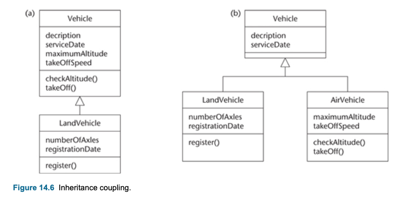<br>

* Cohesion is a measure of the degree to which an element contributes to a single purpose
    * Operation cohesion measures the degree to which an operation focuses on a single functional requirement.
    * Class cohesion reflects the degree to which a class is focused on a single requirement
    * Specialization cohesion addresses the semantic cohesion of inheritance hierarchies.

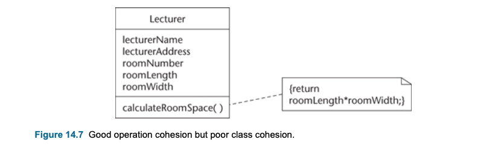<br>
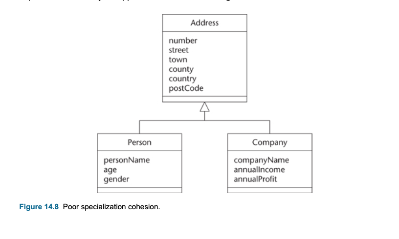<br>
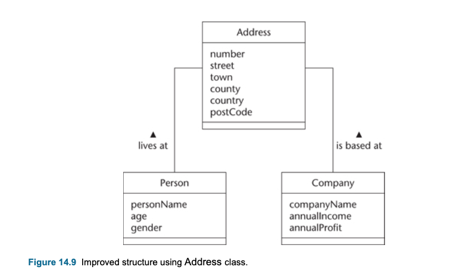<br>

## Attributes and operation specification

* Attributes data types are show with this formule:
    * ```js <property> ::= [<visibility>] [‘/’] <name> [‘:’ <prop-type>] [‘[’ <multiplicity> ‘]’] [‘=’ <default>] [‘{’ <property-string > [‘,’ <property-string >]* ‘}’] ```
    * For example :
        * with default value -> balance: Money = 0.00
        * not null -> accountName: String {not null}
        * multipilicity -> qualification: String[0..10]
        * class (static) variable attribute/method -> underlined
* The values of some attributes can be derived from other attributes in the same class or other classes.
    * They may have been identified in analysis, but will not be implemented as attributes in design.
    * derived attribute indicated in UML by the symbol ‘/’ before the name of the attributed
* **Primary operations** are certain standard operations that are normally included in all classes.
    * Constructor, Destructor, Get operation, Set operation
    * Usually primary operation does not show in class diagram, because assumed that this primary
* Visibility functionality is already available, thats why mostly in diagrams prefer show main functionaly , thats why
  primary operation can omitted.
    * Protected means the feature may be used either by the class that includes it, or by a subclass or descendant of
      that class, or by classes in the same package

* Operation signatures: eg credit(amount: Money): Boolean
    * ```js <parameter-list> ::= <parameter> [‘,’<parameter>]* <parameter> ::= [<direction>] <parameter-name> ‘:’ <type-expression> [‘[’<multiplicity>‘]’ [‘=’ <default>] [‘{’ < property-string >[‘,’ < property-string >]* ‘}’] ```

* Naming:
    * Singular names for classes, eg Customer
    * Attribute names needs to be unabbreviated names with a noun from the domain. eg firstName is better fName
    * Operations should be named with a strong verb, eg validateNumber() is better than numberChecking()

<br>
<br>

## Designing associations and constraints

* one-to-one association (one way)

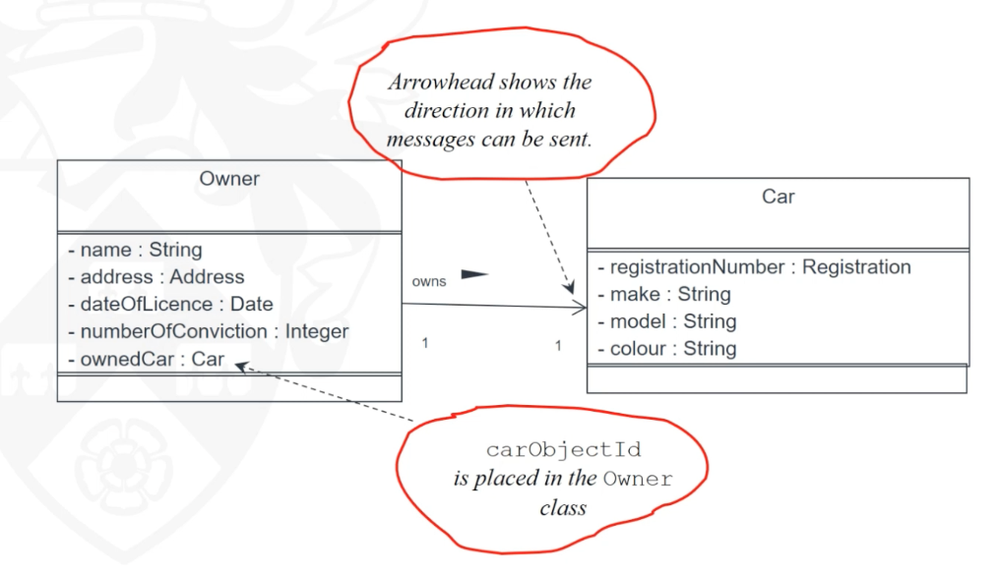<br>

* one-to-many (one way)
    * There is also another way to do by using a collection class in it, but still there is a one-to-many association
    * . One-to-many association can be designed with one collection class and many-to-many with two collection classes.
      <br>
      <br>

* many-to-many (two way)
    * in the second sample 2 ways association is turning one way one-to-many association
    * When we revert many to many to -> one to one or one to many, we reducing coupling.  
      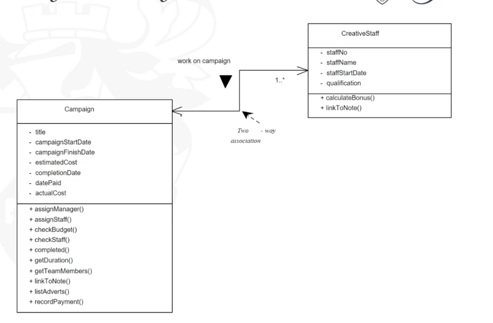<br>
      <br>

## Constraints Design

* Referential constraints :  Referential integrity ensures that an object identifier in an object is actually referring
  to an object that exists,
    * eg one campaign has one manager.
* Design dependency constraints: Dependency constraints ensures that derived attributes, where one attribute may be
  calculated from other attributes, are maintained consistently.
    * eg totalAdvertCost attribute needs to update when an advert add or remove.

* Design associations constraint: ?????
* Domain integrity constraints : Domain integrity ensures that attributes only hold permissible values
    * eg, cost type needs to be float, it checks the data type while setting attribute
    * eg, customer age needs to be more than 18, check age wile customer object created

# Software design patterns

* An OO pattern is an abstraction of a small group of classes.
* Patterns are not frameworks and not actual design. Frameworks are larger than patterns
* Framework is partially codifies a design for solving a family of problems in a specific domain.
* Levels of reuse:
    * the overall architecture level,
    * Frameworks that are at a macro-architecture level,
    * Instantiated patterns are at a micro-architecture level,
    * individual class is at the lowest level of reuse.

<br>

* Why we use ?
    * Saves analyse and design time
    * Solution is thought to be good
    * Easier to communicate with higher level of abstraction
    * But it is not always clear when a pattern is applicaple, It requires expertise for the appropriate use of
      patterns.

* The major differences between patterns and frameworks:
    * Patterns are more abstract and general than frameworks. A pattern is a description of the way that a type of
      problem can be solved, but the pattern is not itself a solution.
    * Unlike a framework, a pattern cannot be directly implemented in a particular software environment. A successful
      implementation is only an example of a design pattern.
    * Patterns are more primitive than frameworks. A framework can employ several patterns but a pattern cannot
      incorporate a framework.

* A **pattern catalogue** is a group of patterns that are related to some extent and may be used together or
  independently of each other.
* The patterns in a **pattern language** are more closely related, and work together to solve problems in a specific
  domain
* The **pattern template** determines the style and structure of the pattern description, and these vary in the emphasis
  they place on different aspects of patterns.
    * Name. A pattern should be given a meaningful name that reflects the knowledge embodied by the pattern.
        * This may be a single word or a short phrase
    * Problem. This is a description of the problem that the pattern addresses (the intent of the pattern)
        * It should identify and describe the objectives to be achieved, within a specified context and constraining
          forces.
    * Context. The context of the pattern represents the circumstances or preconditions under which it can occur.
        * The context should provide sufficient detail to allow the applicability of the pattern to be determined.
    * Forces. The forces of a pattern are the constraints or issues that must be addressed by the solution
    * Solution. The solution is a description of the static and dynamic relationships among the parts of the pattern.
        * The structure, the participants and their collaborations are all described.
        * A solution should resolve all the forces in the given context.
        * A solution that does not resolve all the forces fails.

# GOF Design Patterns (Gang of four)

* A catalogue of 23 design patterns that are still widely used today.
* The GOF patterns are categorized as **creational**, **structural** or **behavioural** to reflect their different
  purposes.
* The GOF patterns are generally concerned with increasing the ease with which an application can be changed, by
  reducing the coupling among its elements and maximizing their cohesion.
* **Changeability** involves several different aspects (Buschmann et al., 1996): maintainability, extensibility,
  restructuring and portability. D
    * Maintainability is concerned with the ease with which errors in the information system can be corrected.
    * Extensibility addresses the inclusion of new features and the replacement of existing components with new improved
      versions. It also involves the removal of unwanted features.
    * Restructuring focuses on the reorganization of software components and their relationships to provide increased
      flexibility.
    * Portability deals with modifying the system so that it may execute in different operating environments, such as
      different operating systems or different hardware.

## Creational Pattern

* A creational design pattern is concerned with the construction of object instances.

### Singleton

* Singleton pattern helps to ensure to create one instance of an object.
* The solution involves three elements:
    * private constructor that restricts the outside access.
    * static operation getCompanyInstance,
    * static variable companyInstance.
    * allows global access to the static operation.
* With this solution private constructure can access by static operation.
* Template
    * Name. Singleton.
    * Problem. How can a class be constructed that should have only one instance and that can be accessed globally
      within the application?
    * Context. In some applications it is important that a class has exactly one instance. A sales order processing
      application may be dealing with sales for one company. It is necessary to have a Company object that holds details
      of the company’s name, address, taxation reference number and so on. Clearly there should be only one such object.
      Alternative forms of a singleton object may be required depending upon initial circumstances.
    * Forces. One approach to making an object globally accessible is to make it a global variable, but in general this
      is not a good design solution as it violates information hiding. Another approach is not to create an object
      instance at all but to use class operations and attributes (called ‘static’ in C++ and Java). However, this limits
      the extensibility of the model since polymorphic redefinition of class operations is not possible in all
      development environments (for example C++).
    * Solution. Create a class with a class operation getInstance(), which, when the class is first accessed, creates
      the relevant object instance and returns the object identity to the requesting object. On subsequent accesses of
      the getInstance() operation no additional instance is created but the object identity of the existing object is
      returned.

<br>
<br>

## Structural Pattern

* Structural patterns address issues concerned with the way in which classes and objects are organized.

### Composite Pattern

* Can use composite pattern when object represents a tree structure.
    * For example, assambly a computer requires sub node as cabinet (harddrive and Motherboard (CPU, RAM )) and periphel
      devices (mouse , keyboard)
    * When we would like to reach eg price attribute we can see that from leaf to composite object has price info
* leaf and composite nodes should have common features/functions which can accessable from to any nodes.
* Then we can create a common abstract class to create a contract between and generalise composite and leaf objects,
* Composite object is also can have other composite object list in it too, that creates an assosication between contract
  and composite object.
* Template
    * Name. Composite.
    * Problem. There is a requirement to represent whole–part hierarchies so that both whole and part objects offer the
      same interface to client objects.
    * Context. In an application both composite and component objects exist and are required to offer the same
      behaviour. Client objects should be able to treat composite or component objects in the same way. A commonly used
      example for the composite pattern is a graphical drawing package. Using this software package a user can create (
      from the perspective of the software package) atomic objects like circle or square and can also group a series of
      atomic objects or composite objects together to make a new composite object. It should be possible to move or copy
      this composite object in exactly the same way as it is possible to move or copy an individual square or a circle.
      See Figs 8.5 and 8.6 which illustrate a straightforward composition without using the Composite pattern.
    * Forces. The requirement that the objects, whether composite or component, offer the same interface suggests that
      they belong to the same inheritance hierarchy. This enables operations to be inherited and to be polymorphically
      redefined with the same signature. The need to represent whole–part hierarchies indicates the need for an
      aggregation structure.
    * Solution. The solution resolves the issues by combining inheritance and aggregation hierarchies. Both subclasses,
      Leaf and Composite, have a polymorphically redefined operation anOperation(). In Composite this redefined
      operation invokes the relevant operation from its components using a simple loop construct. The Composite subclass
      also has additional operations to manage the aggregation hierarchy so that components may be added or removed.

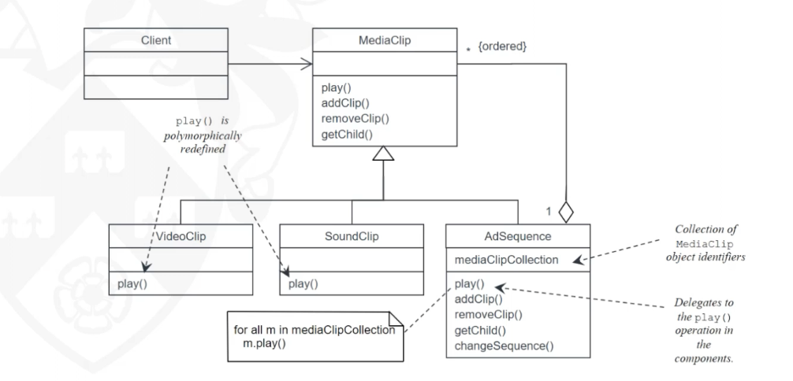<br>
<br>

## Behavioral Pattern

* Behavioural patterns address the problems that arise when responsibilities are assigned to classes and in designing
  algorithms.

### Strategy Pattern

* When the behaviour is changing depends on the state of the object, we can use if-else blocks to solve, but this
  solution can cause tight coupling and low cohesion problem after some time later and make very complex test and
  maintain.
* To prevent from this problem, State pattern allocates each state related behaviour to individual state class, then
  represent an abstract class that has common functionalty of states that has its own implementation in it.
* Force of state pattern:
    * The state related behaviour can be constructed via a public method that invoke various private state related
      operations. However, this results in a large complex object that is difficult to construct, test and maintain.
* Solution of state pattern:
    * Separate the original behaviour and allocate to the individual state object. The original object becomes an
      aggregate of its state, only one of which is active at any one time.
* Template
    * Name. State.
    * Problem. An object exhibits different behaviour when its internal state changes making the object appear to change
      class at run-time.
    * Context. In some applications an object may have complex behaviour that is dependent upon its state. In other
      words, the response to a particular message varies according to the object’s state. One example is the calcCosts()
      operation in the Campaign class.
    * Forces. The object has complex behaviour, which should be factored into less complex elements. One or more
      operations have behaviour that varies according to the state of the object. Typically the operation would have
      large, multi-part conditional statements depending on the state. One approach is to have separate public
      operations for each state but client objects would need to know the state of the object so that they could invoke
      the appropriate operation. For example, four operations calcCostsCommissioned(), calcCostsActive(),
      calcCostsCompleted() and calcCostsPaid() would be required for the Campaign object. The client object would need
      to know the state of the Campaign object in order to invoke the relevant calcCosts() operation. This would result
      in undesirably tight coupling between the client object and the Campaign object. An alternative approach is to
      have a single public calcCosts() operation that invokes the relevant private operation (calcCostsCommissioned()
      would be private). However, the inclusion of a separate private operation for each state may result in a large
      complex object that is difficult to construct, test and maintain.
    * Solution. The State pattern separates the state-dependent behaviour from the original object and allocates this
      behaviour to a series of other objects, one for each state. These state objects then have sole responsibility for
      that state’s behaviour. The original object, shown as Context in Fig. 15.18, delegates responsibility to the
      appropriate state object. The original object becomes an aggregate of its states, only one of which is active at
      one time. The state objects form an inheritance hierarchy.

<br>

### Observer Pattern

* Pattern name: Observer
* Description: Separates the display of the state of an object from the object itself and allows alternative displays to
  be provided. When the object state changes, all displays are automatically notified and updated to reflect the change.
* Problem description: In many situations, you have to provide multiple displays of state information, such as a
  graphical display and a tabular display. Not all of these may be known when the information is specified. All alter-
  native presentations should support interaction and, when the state is changed, all displays must be updated. This
  pattern may be used in situations where more than one display format for state information is required and where it is
  not necessary for the object that maintains the state information to know about the specific display formats used.
* Solution description: This involves two abstract objects, Subject and Observer, and two concrete objects,
  ConcreteSubject and ConcreteObject, which inherit the attributes of the related abstract objects. The abstract objects
  include general operations that are applicable in all situations. The state to be displayed is maintained in
  ConcreteSubject, which inherits operations from Subject allowing it to add and remove Observers (each observer
  corresponds to a display) and to issue a notification when the state has changed. The ConcreteObserver maintains a
  copy of the state of ConcreteSubject and implements the Update() interface of Observer that allows these copies to be
  kept in step. The ConcreteObserver automatically displays the state and reflects changes whenever the state is
  updated. The UML model of the pattern is shown in image below.
* Consequences: The subject only knows the abstract Observer and does not know details of the concrete class. Therefore
  there is minimal coupling between these objects. Because of this lack of knowledge, optimizations that enhance display
  performance are impractical. Changes to the subject may cause a set of linked updates to observers to be generated,
  some of which may not be necessary.

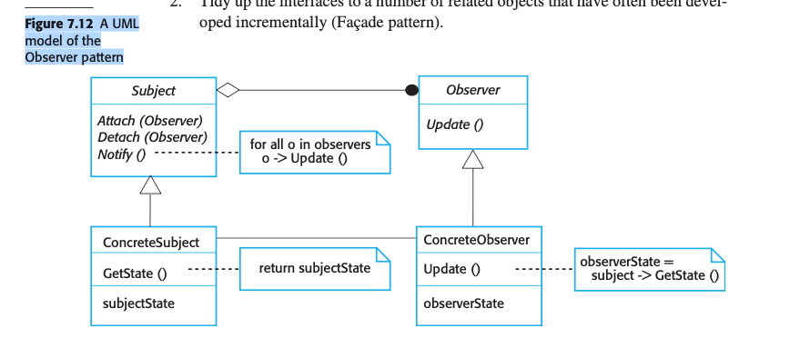<br>

# Questions

* What is the key problem with closed architecture?
    * Each layer introduces a speed & storage overhead
* What's the key strength and weakness with an open layered architecture?
    * Strength: Can bypass layers and avoid performance bottlenecks.
    * Weakness: But suffer the penalty of increased coupling due to extra dependencies.
* What is a possible issue with a repository architecture?
    * Repository can become a bottleneck, e.g. queue requests.
* In a client-server architecture, does the client know the server?
    * Yes
* In a client-server architecture, does the server know the client?
    * No
* In contrast with the client-server architecture, why is peer-to-peer architecture not easy to maintain?
    * Because it introduces more coupling and control flow hazards
* In a broker architecture, does the client need to know where the server is?
    * No
* In the MVC architecture, does a view know the model?
    * Yes
* In the MVC architecture view component, as long as the update message remains unchanged, do you need to recompile the
  model component if changes are made in the view?
    * No
* What is the effect of propagation mechanism with respect to package coupling?
    * Reduce coupling to some extent

[Design Patterns](https://sourcemaking.com/design_patterns)
[Composite pattern](https://www.youtube.com/watch?v=mp5lwolO-wM)

# TODO:

* activity 5.8 check again! 