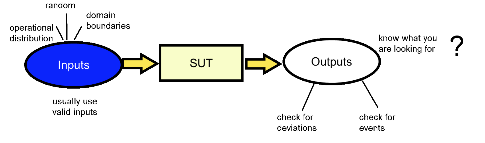
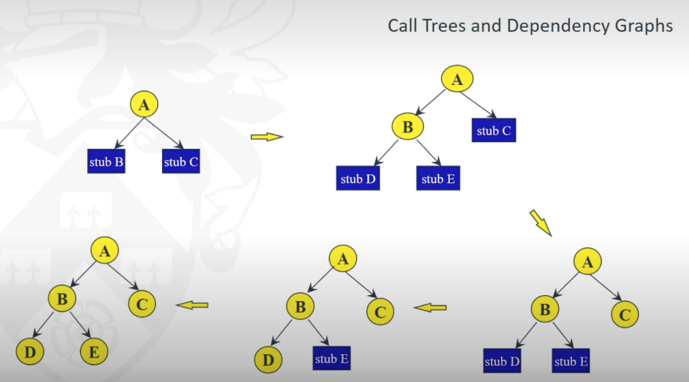
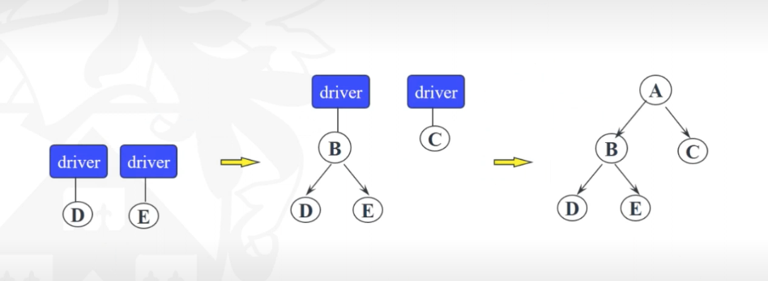
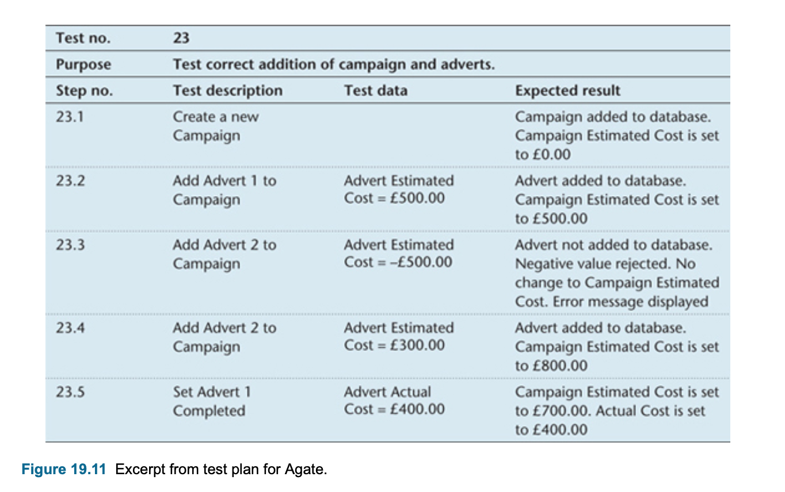
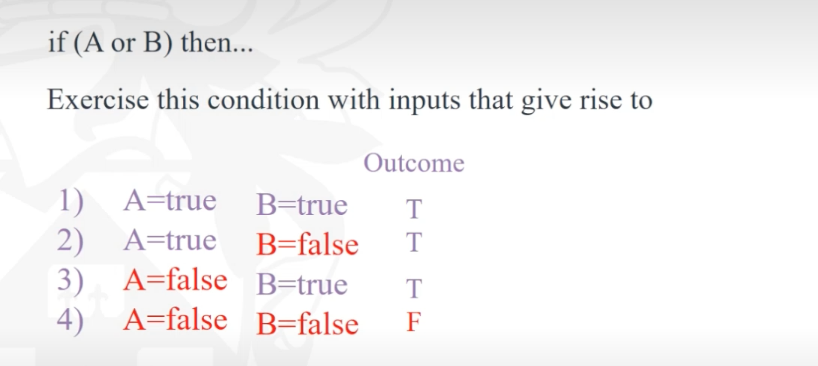
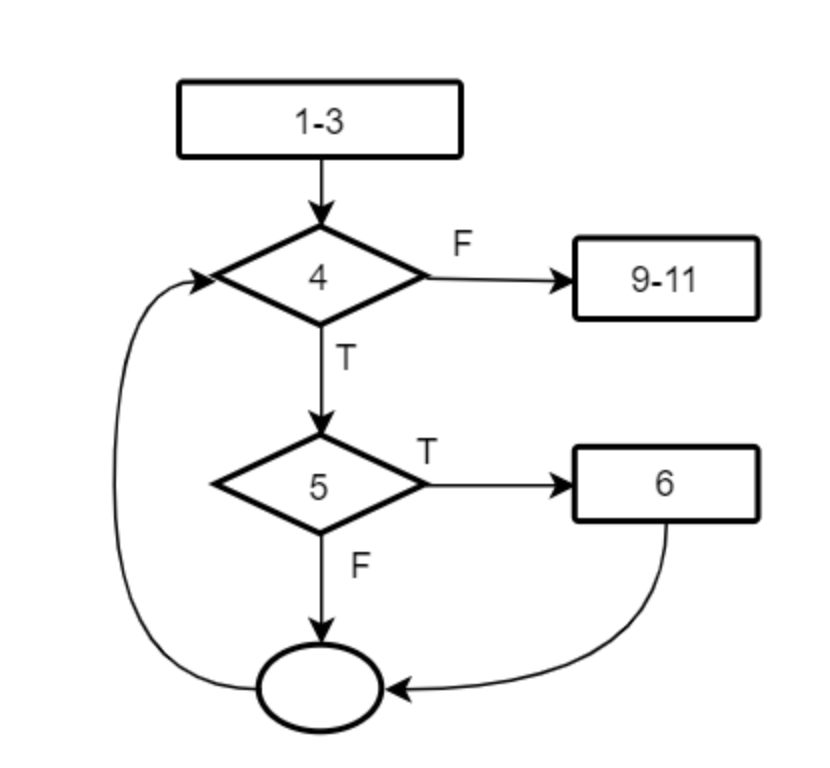
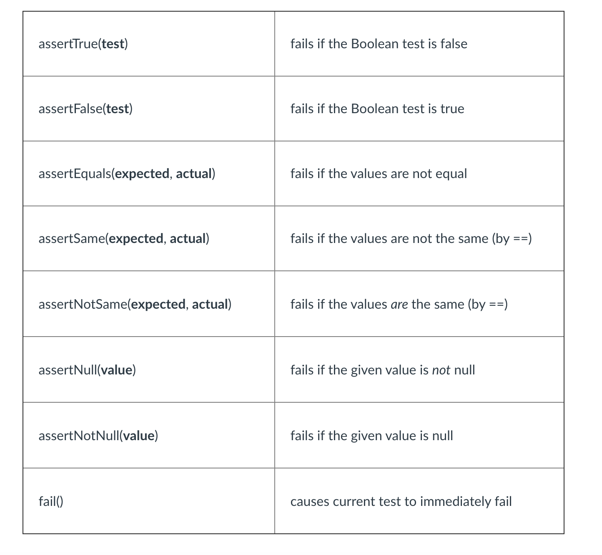

#### Main Topics

* Design tests for black box and white box testing
* Design and conduct JUnit tests
* Critically evaluate various approaches to software testing
* Apply a range of refactoring techniques to improve code quality

Relevant Module Learning Outcomes

* Critically evaluate and apply a range of tools and techniques for automated software testing, including test-driven
  development,
* Apply a range of refactoring techniques to improve code quality

#### Sub titles:

* [Specification-based testing](#specification-based-testing)
    * [Five Level Testing](#five-level-testing)
        * [Unit Testing](#unit-testing)
        * [Integration Testing](#integration-testing)
        * [Subsystem testing](#subsystem-testing)
        * [System testing](#subsystem-testing)
        * [Regression Testing](#regression-testing)
        * [User Acceptance Testing](#user-acceptance-testing)
    * [3 Level Testing](#3-level-testing)
    * [Test Planning](#test-planning)
    * [Specification-based testing (Black box testing)](#specification-based-testing-black-box-testing)
* [Structural Testing (White box testing)](#structural-testing-white-box-testing)
    * [Control Flow Graph](#control-flow-graph)
    * [Statement and Branch coverage](#statement-and-branch-coverage)
    * [Conditional coverage](#conditional-coverage)
* [White and Black test is used for](#white-and-black-test-is-used-for)
* [JUnit and refactoring](#junit-and-refactoring)

# Specification-based testing

* “Software testing consists of the dynamic verification of the behaviour of a program on a finite set of test cases,
  suitably selected from the usually infinite executions domain, against the expected behaviour.” (SWEBOK 2004)
* Overal process:
    * Identify parts of the software to be tested (SUT)
    * Identify interesting input values
    * Identify expected results (functional) and execution characteristics (non-functional)
    * Run the software on the input values
    * Compare results & execution characteristics to expectations



* **limitation of testing**: Testing can only show the presence of errors, never their absence
    * We should be aware of the limitations of testing Why?
        * theoretically we cannot test for termination
        * practically there is the sheer number of cases, e.g. multiplying two integers today would mean 2128
          combinations and it is practical to test them all.

* **Motivation for software testing** :  The underlying motive for software testing is to make apparent aspects of
  **software quality**, using methods that can be economically and effectively applied and with sufficient accuracy to
  allow the taking of informed risk-decisions.
    * testing is essential evidence to determine whether the quality of the software matches specifications or exceeds
      expectations

* Testing of software is necessary to **ensure that it meets the requirements**, both to check that the software
  complies with the requirements (**verification**), and to check that it has been written correctly and effectively (**
  validation**).
    * **verification** checks that the right software has been written;
    * **validation** checks that the software has been written right.

## Five Level Testing

* Testing can take place at as many as five levels:
    * unit testing
    * integration testing
    * subsystem testing
    * system testing
    * acceptance testing.

### Unit Testing

* Unit testing : units are likely be individual classes
    * Testing classes should include **desk check**, n which the tester manually walks through the source code of the
      class before compilation
        * Code needs to compile and the result of compilation should be error free.
    * To test the running of a class the tester will require some kind of test program (the term **harness** is often
      used) that will create one or more instances of a class, populate them with data and invoke both instance
      operations and class operations.
    * Needs to test the operations that have been implemented will be tested to ensure that they comply with the
      pre-conditions and that the post-conditions are met when they have complete.
* Programmers will develop their own tools to provide **harnesses** within which to test classes and subsystems
  according to company standards

### Integration Testing

* Unit testing merges into integration testing when groups of classes are tested together.
    * The obvious test unit at this point is either the use case to test the system from the user’s perspective or the
      component to test the correct working of components and the interaction between components.
* Integration starts when units and components are tested.
* Integration testing tests the interactions between components to make sure sub-elements are combined into a coherent
  composite element. Integration testing assesses consistency of interfaces, e.g. message signatures and parameters.
* Three approaches for integration testing
    * top-down
        * This method starts with the top-level element, with the called elements replaced by stubs
        * A stub simulates an aspect of a called procedure’s execution, typically returning hard- wired results, for
          example the use of System.out.println () when you debug your Java programs.
        * As the top-most modules are tested, stub leaves are replaced with the actual components and their callees are
          stubbed out.
        * The resulting graph is a call tree or dependency graph.
        * Good approach for assigning main control structures, because the environment of testing is the actual
          execution environment, control problems or fundamental architectural problems can be revealed from the very
          beginning.



    * bottom-up
        * starts at lowest level (units) and progressively combines into larger subsystems until final system is reached
        * Integration of lower level elements requires a driver.
        * It is good that bottom up testing allows parallel testing
        * But environment of testing is not actual execution environment, control problems or fundamental architectural
          problems may not surface until very late.



    * big-bang approach
        * All the method links, edits, compiles and runs all the modules together.
        * Often reveals some errors
        * May possibly be used to create a backbone network, which can subsequently act as a test harness.
        * it is only interesting for small to moderate size projects.


### Subsystem testing

* Use cases that share the same persistent data should be tested together.
* This kind of testing should check that applications work correctly when multiple clients are accessing the database
  and that transactional database updates are carried out correctly.
* This is one form of subsystem testing in which the subsystems are built around different business functions that make
  use of the same stored data.

### System testing

* System testing is defined as the testing of a complete and fully integrated software product.
    * This validates the complete and fully integrated software product
* System testing falls in black-box testing wherein knowledge of the inner design of the code is not a pre-requisite and
  is done by the testing team.

### Regression Testing

* **Regression testing** : If significant changes are made to a system, then some of the tests must be run again to
  ensure that the changes have not broken existing functionality.

### User Acceptance Testing

* Final state is **user acceptance test**, during which the system is evaluated by the users against the original
  requirements before the client signs the project off.
* Documentation produced during requirements capture and analysis will be used to check the finished product, in
  particular use case scenarios and non-functional requirements.

## 3 Level Testing

* Testing is sometimes described as taking place at three levels.
    * Level 1
        * Tests individual modules (e.g. classes or components).
        * Then tests whole programs (e.g. use cases).
        * Then tests whole suites of programs (e.g. the Agate application).
    * Level 2
        * Also known as alpha testing or verification.
        * Executes programs in a simulated environment.
        * Particularly tests inputs that are:
            * negative values when positive ones are expected (and vice versa)
            * out of range or close to range limits
            * invalid combinations.
    * Level 3
        * Also known as beta testing or validation.
        * Tests programs in live user environment:
            * for response and execution times with large volumes of data
            * for recovery from error or failure.

## Test Planning

* Test documentation shows details of each test and its expected outcomes with plan
  

# Specification-based testing (Black box testing)

* Black box testing is asking ‘Never mind how it works, what does it produce?’
* No need to know specialist programming knowledge or access to source code.
* The software is treated as a black box.
* Black box testing does not investigate how the processing is carried out
* Black box testing tests the quality of performance of the software
* It is also necessary to check how well the software has been designed internally
* Ask questions:
    * Does it do what it’s meant to do?
    * Does it do it as fast as it’s meant to do it?
* Specification-based testing allows the behaviour of an application to be evaluated without regard to its internal
  logic, i.e. a representative range of inputs are selected and evaluation is made on the basis of whether the outputs
  seen are as expected.
* Its principles apply at many levels, e.g. system functional specification and unit design specification.
* For most systems, it is impossible to exercise the program with all inputs. We have to choose a set of test inputs
  i.e. representative input.
    * This is somewhat subjective: a matter of feeling and confidence.
* Representative inputs can be derived from equivalence classes.
    * Equivalent classes and boundary value analysis are the key concept related to specification-based testing.
* The input space can be partitioned into classes. Inputs in the same class are expected to be handled by the
  specification ‘in the same way’.
* Once we have the equivalence classes, we can then choose representative inputs. The number ofpoints chosen really
  depends on how ‘representative’ you think your chosen points are.
    * Bear in mind that the (implicit) assumption is that all points in the class are representative of the whole class
* An example to see how equivalence classes can be used to detect errors.
  

* Black box tests are based on the actual requirements, not the internals.
* Let’s pick one representative input from each class: 1 and 7. So for input 1, the specified output is 0,the test
  result is 0 so it passes. For input 7, the specified output is 7,but the test output is 49, so the error is detected.


* Equvalence classes are good to detect errors
* But there is some potential problems
    * First, you may not detect errors with additional deliberately implemented (but not documented!) functionality.
    * Second, implementers may choose to refine a specification class into smaller classes, e.g. for efficiency reasons.
      Implementation may only be correct for some subclasses.
    * Third, misplacement of implemented boundaries may be missed. This can be dealt with by using boundary value
      analysis.
* Boundary value analysis is to select values at or near where behaviour should change.
* equivalence classes for
    * abs(x): two equivalence classes: x>=0, x<0
    * min(x, y): two equivalence classes: x>=y, x<y

* For a function:  If the input (natural number) X is less than or equal to 10 then return 0 else return the value of
  the input,
    * Representative input:
        * T1=(X=5), output=0
        * T2=(X=15), output=15
    * Boundary values:
        * T2=(X=9), output=0
        * T2=(X=10), output=0
        * T2=(X=11), output=11

# Structural testing (White Box Testing)

* Structural testing is also known as “white-box”, “glass-box”, or “code-based” testing
* White box testing is asking for ‘Never mind what it’s for, how well does it work?
* It tests the internal workings of the software and whether the software works as specified
* White box testing tests the quality of construction of the software.
* Ask questions
    * Is it not just a solution to the problem, but a good solution?
* Structural testing judges test suite thoroughness based on the structure (e.g. control flow graphs) of the program
  itself
* Testing adequacy is defined in terms of graph coverage, e.g. statement, branch, condition, and path coverage
* Structural testing is a powerful unit testing technique.
    * Many authors believe that structural testing will discover about 35% of bugs.
    * The coverage measures can also be used to guide testing.
* Structural testing, however, does not reveal missing functions and specification errors.

## Control Flow Graph

* Block : Rectangle represents a sequence of program statements
* Decision: decision represented by a diamond. It is the point at which control flow can diverge e.g. if and case
  statements.
* Junction: circle representing junctions. Junction is point at which control flow can merge e.g., end if, end loop.


## Statement and Branch coverage

* Statement coverage aims to execute each statement (i.e. block node in the CFG) at least once.
* 100% statement coverage is a frequently specified requirement.
    * In this example, the test T1 will exercise the statement Z:=X+5; once, therefore gives statement coverage.But what
      if “B>6” should have been “B>=5”? This error cannot be detected by the test.


* Branch or decision coverage aims to have each branch (edge in the CFG) executed at least once.
    * For example the decision point (X>0 and Y>0) has two branches: the true branch and the false branch.Test T1 will
      exercise the false branch and T2 will exercise the true branch. The two tests therefore provides 100% branch
      coverage as well as statement coverage.


* How to choose the path to get coverage?
    * The advice is to pick simple, functionally sensible paths first, then pick additional paths that are small
      variations on previous paths.
    * Pick additional paths that have obvious functional meaning, and pick the paths that have no obvious functional
      meaning only if it is necessary to provide coverage.
    * Better focus on small parts of the program rather than large parts.


* Descriptions of structural Coverage:
    * Statement coverage is the proportion of source statements exercised by the test set. Statement coverage is a
      relatively weak criterion, but provides a level of confidence that some basic testing has been done.
    * Decision or branch coverage is a measure of branches that have been evaluated to both true and false in testing.
      When branches contain multiple conditions, branch coverage can be 100% without instantiating all conditions to
      true/false.

    * Condition coverage measures the proportion of conditions within decision expressions that have been evaluated to
      both true and false. Note that 100% condition coverage does not guarantee 100% decision coverage. For example,
      “if (A || B) {do something} else {do something else}” is tested with [0 1], [1 0], then A and B will both have
      been evaluated to 0 and 1, but the else branch will not be taken because neither test leaves both A and B false.

    * MC/DC requires that every condition in a decision in the program has taken on all possible outcomes at least once,
      each condition has been shown to independently affect the decision outcome, and that each entry and exit point
      have been traversed at least once.

### Task

* Consider the following method:

```java
 int ABS(int x)
        {
        if(x< 0)
        x=-x;
        return x;
        }
```

* {T= value , output}
* Design a minimal set of tests to achieve statement coverage only. -> The test set {T1= -1,1} can achieve statement
  coverage
* Design a minimal set of tests to achieve branch coverage. -> The test set { T1= -1, 1; T2= -2, 2 } can achieve branch
  coverage
* Draw a control flow graph that represents the method code.


## Conditional coverage

* Conditional coverage requires each condition in a compound predicate to take on each truth value: true once and false
  once.
* With **multiple-condition**  coverage, test cases are written to cover all possible combinations of condition
  outcomes.
* Multiple-condition coverage also satisfies decision (or branch) coverage and condition coverage.
* The problem with multiple condition coverage is that test suite size is an exponential blowup, e.g. 2 conditions need
  4 tests, 3 conditions 8 tests and 4 conditions 16 tests etc.
* MC/DC (Multiple condition \ decision condition) refers to modified condition and decision coverage.
* The set of tests that achieves MC/DC coverage must **satisfy three conditions**: Branch coverage, Condition coverage ,
  Each condition makes a difference with respect to the outcome
* Making a difference means when a variable takes on different values, you will get the different outcome (assuming
  other variables remain the same).
    * For example tests 2-4 are sufficient to show that each variable makes a difference, with each variable
      independently affects the outcome.
    * But Tests 1-3, however, do not achieve MC/DC because variable A in test 1 and test 3 does not make a difference to
      the outcome when B=true.
* MC/DC achieves a good balance of thoroughness and test size

  
  

* [MC/DC Youtube video](https://www.youtube.com/watch?v=9i9xpxn6pzM)
    * Create a truth table,
    * Select one condition and a test then search for the similar test condition with filiped value of selected
      condition
    * if result is also filipd then those 2 test can use .


## Activity

* Design tests for white-box testing:
    * Draw a control flow graph
    * Write a test that can achieve statement, but not branch coverage for the max method

  
  

    * Answer :  T= {1, 2, 3, 4} will achieve statement but not branch coverage. It leaves 5F->O branch unexecuted.

# White and Black test is used for

* completeness (black box and white box)
* correctness (black box and white box)
* reliability (white box)
* maintainability (white box).

# JUnit and refactoring

## Unit testing

* Unit (or module or component) testing is the lowest level of testing where each unit is individually tested to ensure
  that its behaviour meets its specification.
* Units are tested under the control of a test harness, e.g. Junit.
* To run a unit teat in Junit we have to flag with @Test annotation
* To all methods in Junit [Junit Source Lib Doc](http://junit.sourceforge.net/javadoc/)
* You can setup fixtures before/after **all test methods** run test by using

  

```java
@Before public void setup(){...}
@After public void teardown(){...}
```

* If you want to set up test fixtures **once** before/after the entire test class

```java
@BeforeClass public static void setUpBeforeClass(){...}
@AfterClass public static void tearDownAfterClass(){...}
```

## Refactoring

* Refactoring is the process of improving the design of existing code without changing its observable behaviour
* Refactoring is supported by unit tests.
* Refactoring aims to replace code that **‘smells’**, e.g. duplicated code, big method, class with many instance
  variables, class with lots of code, high coupling between many objects, long parameter lists and many other ways in
  which bad code is written.
* There are about 100 named refactoring methods, such as:
    * **The Extract method:** Transforms a long method into a shorter one by factoring out a portion into a private
      helper method.
    * **Extract a constant:** replaces a literal constant with a constant variable
    * **Extract local variables:** introduces explaining temporary variable

* The major points that you should take away from this the lab:
    * Refactoring involves making structural changes to source code.
    * Even tasks that seem simple (e.g. renaming a class field) would be hard to do with normal IDE features (like
      search and replace). Refactoring without tool support is not practical.
    * IDE's refactoring support effectively understands Java program structure to allow you to make serious changes
      across many files in your project.
    * Having unit tests that show how a system works allows you to refactor without fear of breaking your design.

# Cyclomatic complexity

* The cyclomatic complexity of a section of source code is the maximum number of linearly independent paths within
  it—where "linearly independent" means that each path has at least one edge that is not in one of the other paths. For
  instance, if the source code contained no control flow statements (conditionals or decision points), the complexity
  would be 1, since there would be only a single path through the code. If the code had one single-condition IF
  statement, there would be two paths through the code: one where the IF statement evaluates to TRUE and another one
  where it evaluates to FALSE, so the complexity would be 2. Two nested single-condition IFs, or one IF with two
  conditions, would produce a complexity of 3.
* Mathematically, the cyclomatic complexity of a structured program[a] is defined with reference to the control-flow
  graph of the program, a directed graph containing the basic blocks of the program, with an edge between two basic
  blocks if control may pass from the first to the second. The complexity M is then defined as[2]

* M = E − N + 2P, where
    * E = the number of edges of the graph.
    * N = the number of nodes of the graph.
    * P = the number of connected components.

* How do you know how many paths to look for? The computation of cyclomatic complexity provides the answer. Cyclomatic
  complexity is a software metric that provides a quantitative measure of the logical complexity of a program.
    * When used in the context of the basis path testing method, the value computed for cyclomatic complexity defines
      the number of independent paths in the basis set of a program and provides you with an upper bound for the number
      of tests that must be conducted to ensure that all statements have been executed at least once.
    * Cyclomatic complexity can be used to target modules as candidates for extensive unit testing. Modules with high
      cyclomatic complexity are more likely to be error prone than modules whose cyclomatic complexity is lower.
      Therefore, extra effort should be spent to test these modules.

# Source

* [Junit Tutorial](https://help.eclipse.org/2021-03/index.jsp?topic=%2Forg.eclipse.jdt.doc.user%2FgettingStarted%2Fqs-junit.htm)
* [Junit Source Lib Doc](http://junit.sourceforge.net/javadoc/)
* [Refactoring](https://www.refactoring.com/)
    * [Refactoring 2](https://www.ibm.com/developerworks/java/library/os-ecref/os-ecref-pdf.pdf)

# TODO:

* Read in Pressman’s book section 18.6.2-18.6.3.
* The Pressman book section 18.3-18.5 provides some additional reading on structured testing. Typically you might want
  to look into Cyclomatic Complexity metrics and its uses in path testing.

* Discusision : https://onlinestudy.york.ac.uk/courses/644/discussion_topics/16210?module_item_id=42791

