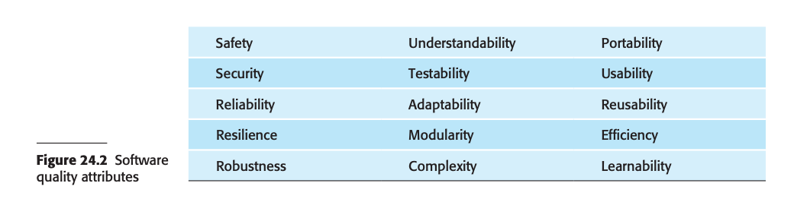
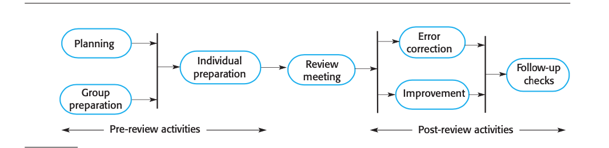
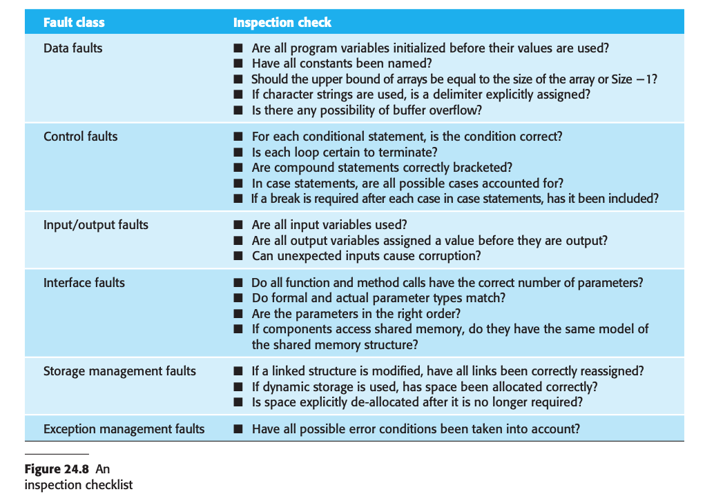
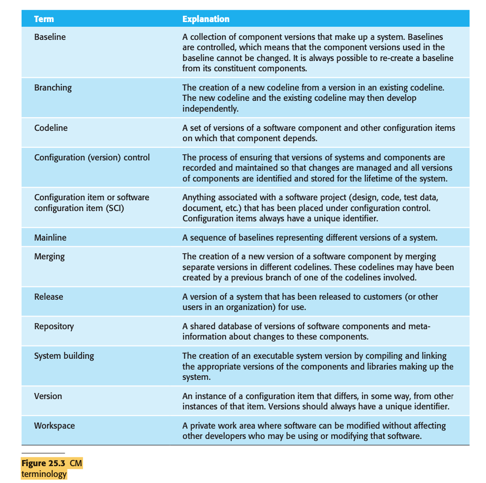
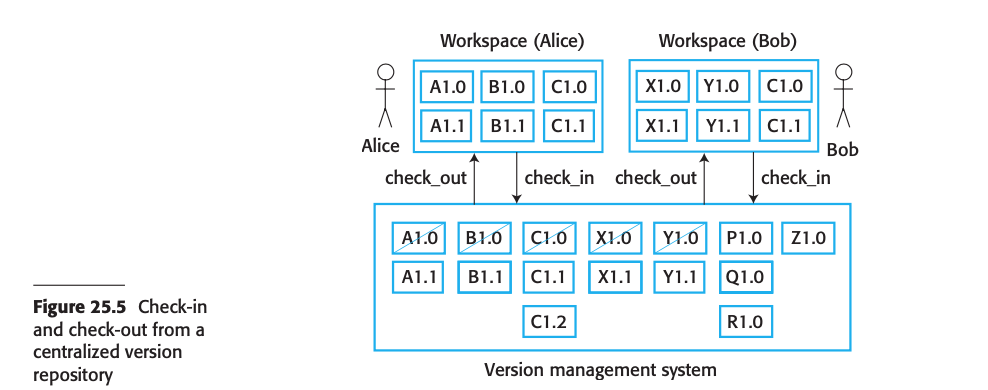
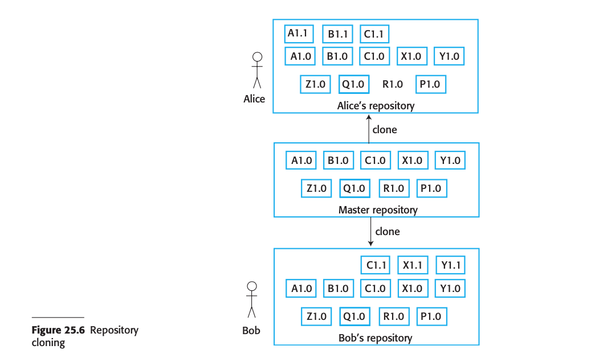
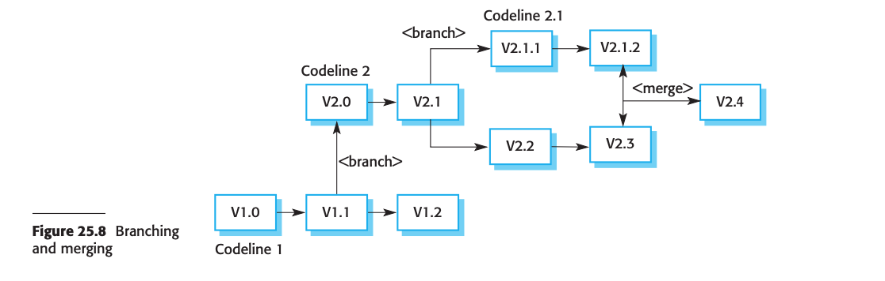
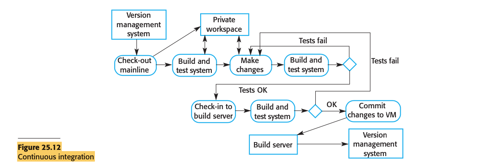
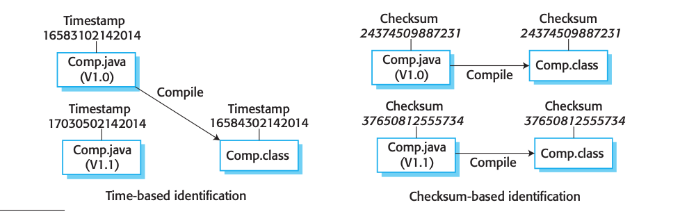

## Main topics

* Apply and evaluate the quality assurance techniques including reviews and inspections.
* Understand change management and theory behind configuration management

Relevant Module Learning Outcomes for this week:

* Manage risk in making changes to an existing software system through rigorous engineering practices
* Critically evaluate the appropriateness of different software engineering techniques/tools in different circumstances,
  and on the quality of the design of an application.

## Sub Titles

* [Quality Managment](#quality-management)
    * [Intro](#intro)
    * [Quality Plan](#quality-plan)
    * [Software Quality](#software-quality)
    * [Software Standards](#software-standards)
    * [Reviews and inspections](#reviews-and-inspections)
        * [The review process](#the-review-process)
        * [Program inspections](#program-inspections)
* [Configuration management](#configuration-management)
    * [Version Managment](#version-managment)
    * [System building](#system-building)
* [Questions](#questions)
    * [What makes a good quality assurance manager](#what-makes-a-good-quality-assurance-manager)
    * [Activity software inspection](#activity-software-inspection)

# Quality management

## Intro

* Software quality management is concerned with ensuring that developed software systems are “fit for purpose.”
    * That is, systems should meet the needs of their users, should perform efficiently and reliably, and should be
      delivered on time and within budget.

* Quality management is both an organizational and an individual project issue
    * In organization level : quality management is concerned with establishing a framework of organizational processes
      and standards that will lead to high-quality software.
    * In Project level: quality management involves the application of specific quality processes, checking that these
      planned processes have been followed, and ensuring that the project outputs meet the defined project standards.
* Software quality management technique:
    * **Quality assurance** is the definition of processes and standards that should lead to high-quality products and
      the introduction of quality processes into the manufacturing process.
    * **Quality control** is the application of these quality processes to weed out products that are not of the
      required level of quality. Both quality assurance and quality control are part of quality management.
* Quality management provides an independent check on the software development process.
* **The QM team** checks:
    * The project deliverables to ensure that they are consistent with organizational standards and goals
    * They also check process documentation, which records the tasks that have been completed by each team working on
      this project.
* The QM team should be independent and not part of the software development group so that they can take an objective
  view of the quality of the software

## Quality Plan

* The quality plan should **set out the desired software qualities** and **describe how these qualities are to be
  assessed**.
    * It defines what “high-quality” software actually means for a particular system
* Outline structure for a quality plan
    * **Product introduction** A description of the product, its intended market, and the quality expectations for the
      product.
    * **Product plans** The critical release dates and responsibilities for the product, along with plans for
      distribution and product servicing.
    * **Process descriptions** The development and service processes and standards that should be used for product
      development and management.
    * **Quality goals** The quality goals and plans for the product, including an identification and justification of
      critical product quality attributes.
    * **Risks and risk management** The key risks that might affect product quality and the actions to be taken to
      address these risks.

## Software Quality

* The manufacturing industry established the fundamentals of quality management in a drive to improve the quality of the
  products that were being made.
* The underlying assumption was that products could be completely specified and procedures could be established that
  could check a manufactured product against its specification.
* It's often impossible to come to an objective conclusion about whether or not a software system meets its
  specification:
    * It is difficult to write complete and unambiguous software requirements.
    * Specifications usually integrate requirements from several classes of stake-holder. The excluded stakeholders may
      therefore perceive the system as a poor-quality system, even though it implements the agreed requirements.
    * It is impossible to measure certain quality characteristics (e.g., maintainability)
      directly, and so they cannot be specified in an unambiguous way.
* Because of these problems, the assessment of software quality is a subjective process.
    * The quality management team uses their judgment to decide if an acceptable level of quality has been achieved.
      They decide whether or not the software is fit for its intended purpose.
* This decision involves answering questions about the system’s characteristics.
    * For example:
        1. Has the software been properly tested, and has it been shown that all requirements have been implemented?
        2. Is the software sufficiently dependable to be put into use?
        3. Is the performance of the software acceptable for normal use?
        4. Is the software usable?
        5. Is the software well structured and understandable?
        6. Have programming and documentation standards been followed in the development process?

* **The subjective quality of a software system is largely based on its non-functional characteristics.**
    * If the software’s functionality is not what is expected, then users will often just work around this deficiency.
      However, if the software is unreliable or too slow, then it is practically impossible for them to achieve their
      goals.
* Software quality is not just about whether the software functionality has been correctly implemented, but also depends
  on non-functional system attributes as shown below.
    * These attributes reflect the software dependability, usability, efficiency, and maintainability.
      
* It is not possible for any system to be optimized for all of these attributes. For example, improving security may
  lead to loss of performance.
* The quality plan should therefore define the most important quality attributes for the software that is being
  developed.
    * It may be that efficiency is critical and other factors have to be sacrificed to achieve it.
* The plan should also include a definition of the quality assessment process.
    * This process should be an agreed way of assessing whether some quality, such as maintainability or robustness, is
      present in the product.

* Traditional software quality management is based on the assumption that the quality of software is directly related to
  the quality of the software development process.
    * This assumption comes from manufacturing systems where product quality is intimately related to the production
      process.
    * A manufacturing process involves configuring, setting up, and operating the machines involved in the process
    * Once the machines are operating correctly, product quality naturally follows.
* here is a clear link between process and product quality in manufacturing because the process is relatively easy to
  standardize and monitor.
    * However, software is designed rather than manufactured, and the relationship between process quality and product
      quality is more complex.
    * Software design is a creative process, so the influence of individual skills and experience is significant.
    * External factors, such as the novelty of an application or commercial pressure for an early product release, also
      affect product quality irrespective of the process used

* Defined processes are important, but quality managers should also aim to develop a **“quality culture”** in which
  everyone responsible for software development is committed to achieving a high level of product quality.
    * They should encourage the team to take responsibility for the quality of their work
* While standards and procedures are the basis of quality management, good-quality managers recognize that there are
  intangible aspects to software quality (elegance, readability, etc.) that cannot be embodied in standards.

## Software Standards

* Software standards play an important role in plan-based software quality management.
* An important part of quality assurance is the definition or selection of standards that should apply to the software
  development process or software product.
* Software standards are important for three reasons:
    * Standards capture wisdom that is of value to the organization. This knowledge is often acquired only after a great
      deal of trial and error. Building it into a standard helps the company reuse this experience and avoid previous
      mistakes.
    * Standards provide a framework for defining what quality means in a particular setting.
    * Standards assist consistency and continuity when work carried out by one person is taken up and continued by
      another.

* Two related types of software engineering standard may be defined and used in software quality management:
    * **Product standards** These apply to the software product being developed. They include document standards, such
      as the structure of requirements documents, documentation standards, such as a standard comment header for an
      object class definition, and coding standards, which define how a programming language should be used.
    * **Process standards** These define the processes that should be followed during software development. They should
      encapsulate good development practice. Process standards may include definitions of specification, design, and
      validation processes, process support tools, and a description of the documents that should be written during
      these processes.

* Standards have to deliver value, in the form of increased product quality.
* Product standards have to be designed so that they can be applied and checked in a cost-effective way, and process
  standards should include the definition of processes that check if product standards have been followed.
* The software engineering standards that are used within a company are usually adapted from broader national or
  international standards
    * National and international standards have been developed covering software engineering terminology, programming
      languages such as Java and C++, notations such as charting symbols, procedures for deriving and writing software
      requirements, quality assurance procedures, and software verification and validation processes (IEEE 2003).
* Software engineers sometimes consider standards to be overprescriptive and irrelevant to the technical activity of
  software development. This is particularly likely when project standards require tedious documentation and work
  recording.
    * Quality managers should do to avoid this:
        * **Involve software engineers** in the selection of product standards If developers understand why standards
          have been selected, they are more likely to be committed to these standards.
        * **Review and modify standards** regularly to reflect changing technologies Standards are expensive to develop,
          and they tend to be enshrined in a company standards handbook.
        * **Make sure that tool support is available to support standards-based development** Developers often find
          standards to be a bugbear when conformance to them involves tedious manual work that could be done by a
          software tool.
* Different types of software need different development processes, so standards have to be adaptable.There is no point
  in prescribing a particular way of working if it is inappropriate for a project or project team.
    * However, when changes are made, it is important to ensure that these changes do not lead to a loss of product
      quality.
* They should decide which of the organizational standards should be used without change, which should be modified, and
  which should be ignored. New standards may have to be created in response to customer or project requirements.

## Reviews and inspections

* Reviews and inspections are quality assurance activities that check the quality of project deliverables.
* This involves checking the software, its documentation, and records of the process to discover errors and omissions as
  well as standards violations.
* During a review, several people examine the software and its associated documentation, looking for potential problems
  and nonconformance with standards.
    * The review team makes informed judgments about the level of quality of the software or project documents.
    * Project managers may then use these assessments to make planning decisions and allocate resources to the
      development process.
* Quality reviews are based on documents that have been produced during the software development process.
    * As well as software specifications, designs, code, process models, test plans, configuration management
      procedures, process standards, and user manuals may all be reviewed
* Reviews are not just about checking conformance to standards. They are also used to help discover problems and
  omissions in the software or project documentation.
    * The conclusions of the review should be formally recorded as part of the quality management process.
    * If problems have been discovered, the reviewers’ comments should be passed to the author of the software or
      whoever is responsible for correcting errors or omissions.

* Reviewing is a public process of error detection, compared with the more private component-testing process.
* Quality reviews are not management progress reviews, although information about the software quality may be used in
  making management decision
* Progress reviews compare the actual progress in a software project against the planned progress. Their prime concern
  is whether or not the project will deliver useful software on time and on budget.

### The review process

* The review processes are structured into three phases:
    * **Pre-review activities** These are preparatory activities that are essential for the review to be effective.
        * Typically, pre-review activities are concerned with review planning and review preparation.
            * Review planning involves setting up a review team, arranging a time and place for the review, and
              distributing the documents to be reviewed
    * **The review meeting** During the review meeting, an author of the document or program being reviewed should “walk
      through” the document with the review team.
        * The review itself should be relatively short—two hours at most.
    * **Post-review activities** After a review meeting has ended, the issues and problems raised during the review
      must be addressed.
        * Actions may involve fixing software bugs, refactoring software so that it conforms to quality standards, or
          rewriting documents.

### Program inspections

* Program inspections are **peer reviews** where team members collaborate to find bugs in the program that is being
  developed.
* Inspections may be part of the software verification and validation processes.
* Program inspections involve team members from different backgrounds who make a careful, line-by-line review of the
  program source code.
    * Defects may be logical errors, anomalies in the code that might indicate an erroneous condition or features that
      have been omitted from the code
    * The review team examines the design models or the program code in detail and highlights anomalies and problems for
      repair.
* During an inspection, a checklist of common programming errors is often used to focus the search for bugs
* Companies that use inspections have found that they are effective in finding bugs
* According to some researches where the defect detection rate is about 25%, with inspections, where the defect
  detection rate was 60%.
* But still some people avoid to use inspection, because:
    * Software engineers with experience in program testing are sometimes unwilling to accept the fact that inspections
      can be more effective for defect detection than testing.
    * Managers may be suspicious because inspections require additional costs during design and development.

* Check list:
  

# Configuration management

* Configuration management (CM) is concerned with the policies, processes, and tools for managing changing software
  systems.
* The configuration management of a software system product involves four closely related activities
    * **Version control** This involves keeping track of the multiple versions of system components and ensuring that
      changes made to components by different developers do not interfere with each other.
    * **System building** This is the process of assembling program components, data, and libraries, then compiling and
      linking these to create an executable system.
    * **Change management** This involves keeping track of requests for changes to delivered software from customers and
      developers, working out the costs and impact of making these changes, and deciding if and when the changes should
      be implemented.
    * **Release management** This involves preparing software for external release and keeping track of the system
      versions that have been released for customer use.
* Agile development, where components and systems are changed several times a day, is impossible without using CM tools.
* The development of a software product or custom software system takes place in three distinct phases:
    * A development phase where the development team is responsible for managing the software configuration and new
      functionality is being added to the software. The development team decides on the changes to be made to the
      system.
    * A system testing phase where a version of the system is released internally for testing. This may be the
      responsibility of a quality management team or an individual or group within the development team. At this
      stage, no new functionality is added to the system. The changes made at this stage are bug fixes, performance
      improvements, and security vulnerability repairs. There may be some customer involvement as beta testers during
      this phase.
    * A release phase where the software is released to customers for use. After the release has been distributed,
      customers may submit bug reports and change requests. New versions of the released system may be developed to
      repair bugs and vulnerabilities and to include new features suggested by customers.
* For large systems, there is never just one “working” version of a system; there are always several versions of the
  system at different stages of development.

* In large software projects, configuration management is sometimes part of software quality management.
    * The quality manager is responsible for both quality management and configuration management. When a pre-release
      version of the software is ready, the development team hands it over to the quality management team.
    * The QM team checks that the system quality is acceptable. If so, it then becomes a controlled system, which means
      that all changes to the system have to be agreed on and recorded before they are implemented.

## Version Managment

* Version management is the process of keeping track of different versions of software components and the systems in
  which these components are used.
    * It also involves ensuring that changes made by different developers to these versions do not interfere with each
      other.
    * In other words, version management is the process of managing codelines and baselines.

* A **codeline** is a sequence of versions of source code, with later versions in the sequence derived from earlier
  versions.
    * Codelines normally apply to components of systems so that there are different versions of each component
* A **baseline** is a definition of a specific system.
    * The baseline specifies the component versions that are included in the system and identifies the libraries used,
      configuration files, and other system information
    * Baselines may be specified using a configuration language in which you define what components should be included
      in a specific version of a system
    * Baselines are important because you often have to re-create an individual version of a system. For example, a
      product line may be instantiated so that there are specific system versions for each system customer. You may have
      to re-create the version delivered to a customer if they report bugs in their system that have to be repaired.
      

* There are two types of modern version control system:
    * **Centralized systems,** where a single master repository maintains all versions of the software components that
      are being developed. Subversion (Pilato, Collins-Sussman, and Fitzpatrick 2008) is a widely used example of a
      centralized VC system.
    * **Distributed systems**, where multiple versions of the component repository exist at the same time. Git (Loeliger
      and McCullough 2012), is a widely used example of a distributed VC system.
* Centralized and distributed VC systems provide comparable functionality but implement this functionality in different
  ways. Key features of these VC systems include:
    * **Version and release identification** Managed versions of a component are assigned unique identifiers when they
      are submitted to the system.
    * **Change history recording** The VC system keeps records of the changes that have been made to create a new
      version of a component from an earlier version
    * **Independent development** Different developers may be working on the same component at the same time.
    * **Project support** A version control system may support the development of several projects, which share
      components. It is usually possible to check in and check out all of the files associated with a project rather
      than having to work with one file or directory at a time.
    * **Storage management** Rather than maintain separate copies of all versions of a component, the version control
      system may use efficient mechanisms to ensure that duplicate copies of identical files are not maintained.
* To support independent development without interference, all version control systems use the concept of a project
  repository and a private workspace.
    * The project repository maintains the “master” version of all components, which is used to create baselines for
      system building.

* When modifying components, developers **copy (check-out)** these from the repository into their workspace and work on
  these copies. When they have completed their changes, the changed components are **returned (checked-in)** to the
  repository.
    * However, centralized and distributed VC systems support independent development of shared components in different
      ways.

* **In centralized systems,** developers check out components or directories of components from the project repository
  into their private workspace and work on these copies in their private workspace. When their changes are complete,
  they check-in the components back to the repository. This creates a new component version that may then be shared.
    * If two or more people are working on a component at the same time, each must check out the component from the
      repository.
    * If a component has been checked out, the version control system warns other users wanting to check out that
      component that it has been checked out by someone else.
    * The system will also ensure that when the modified components are checked in, the different versions are assigned
      different version identifiers and are stored separately
      

* **In a distributed VC system**, such as Git, a different approach is used.
    * A “master” repository is created on a server that maintains the code produced by the development team. Instead of
      simply checking out the files that they need, **a developer creates a clone of the project repository** that is
      downloaded and installed on his or her computer
    * Developers work on the files required and maintain the new versions **on their private repository on their own
      computer**.
    * When they have finished making changes, they **“commit”** these changes and **update their private server**
      repository.
    * They may then “**push**” these changes to **the project repositor**y or tell the integration manager that changed
      versions are available.
    * He or she may then “**pull**” these files to the project repository (see Figure 25.6).
      

* In distibuted model of development has a number of **advantages**:
    * It provides a backup mechanism for the repository. If the repository is corrupted, work can continue and the
      project repository can be restored from local copies.
    * It allows for offline working so that developers can commit changes if they do not have a network connection.
    * Project support is the default way of working. Developers can compile and test the entire system on their local
      machines and test the changes they have made.

* Distributed version control is essential for open-source development where several people may be working
  simultaneously on the same system without any central coordination.

* There is no way for the open-source system “manager” to know when changes will be made.
    * In this case, as well as a private repository on their own computer, developers also maintain a public server
      repository to which they push new versions of components that they have changed.
    * It is then up to the open-source system “manager” to decide when to pull these changes into the definitive system.

* A consequence of the independent development of the same component is that codelines may branch
    * It is generally recommended when working on a system that a new branch should be created so that changes do not
      accidentally break a working system.

* At some stage, it may be necessary to merge codeline branches to create a new version of a component that includes all
  changes that have been made.
    * If the changes made involve completely different parts of the code, the component versions may be merged
      automatically by the version control system by combining the code changes.
    * This is the normal mode of operation when new features have been added.
    * However, the changes made by different developers sometimes overlap. The changes may be incompatible and interfere
      with each other.
    * In this case, a developer has to check for clashes and make changes to the components to resolve the
      incompatibilities between the different versions.

* When a new version is created, the system simply stores a delta, a list of differences, between the new version and
  the older version used to create that new version.
    * One of the problems with a delta-based approach to storage management is that it can take a long time to apply all
      of the deltas.
* As disk storage is now relatively cheap, Git uses an alternative, faster approach.
    * Git does not use deltas but applies a standard compression algorithm to stored files and their associated
      meta-information. It does not store duplicate copies of files. Retrieving a file simply involves decompressing it,
      with no need to apply a chain of operations. Git also uses the notion of packfiles where several smaller files are
      combined into an indexed single file. This reduces the overhead associated with lots of small files. Deltas are
      used within packfiles to further reduce their size.

## System building

* System building is the process of creating a complete, executable system by compiling and linking the system
  components, external libraries, configuration files, and other information.
* System-building tools and version control tools must be integrated as the build process takes component versions from
  the repository managed by the version control system.
* System building involves assembling a large amount of information about the software and its operating environment.
    * Therefore, it always makes sense to use an automated build tool to create a system build. Ideally, you should be
      able to build a complete system with a single command or mouse click.
* Tools for system integration and building include some or all of the following features:
    * **Build script generation** The build system should analyze the program that is being built, identify dependent
      components, and automatically generate a build script (configuration file).
    * **Version control** system integration The build system should check out the required versions of components from
      the version control system.
    * **Minimal recompilation** The build system should work out what source code needs to be recompiled and set up
      compilations if required.
    * **Executable system creation** The build system should link the compiled object code files with each other and
      with other required files, such as libraries and configuration files, to create an executable system.
    * **Test automation** Some build systems can automatically run automated tests using test automation tools such as
      JUnit. These check that the build has not been “broken” by changes.
    * **Reporting** The build system should provide reports about the success or failure of the build and the tests that
      have been run.
    * **Documentation generation** The build system may be able to generate release notes about the build and system
      help pages.

* Building is a complex process, which is potentially error-prone, as three different system platforms may be involved:
    * **The development system**, which includes development tools such as compilers and source code editors.
    * **The build server**, which is used to build definitive, executable versions of the system. This server maintains
      the definitive versions of a system.
    * **The target environment**, which is the platform on which the system executes. This may be the same type of
      computer that is used for the development and build systems.
* Agile methods recommend that very frequent system builds should be carried out, with automated testing used to
  discover software problems.
* Frequent builds are part of a process of continuous integration
* In keeping with the agile methods notion of making many small changes, continuous integration involves rebuilding the
  mainline frequently, after small source code changes have been made
* The steps in continuous integration are:
    * Extract the mainline system from the VC system into the developer’s private workspace.
    * Build the system and run automated tests to ensure that the built system passes all tests.
        * if not inform who made the changes
    * Make the changes to the system components.
    * Build the system in a private workspace and rerun system tests
    * Once the system has passed its tests, check it into the build system server but do not commit it as a new system
      baseline in the VC system.
    * Build the system on the build server and run the tests.
    * If the system passes its tests on the build system, then commit the changes you have made as a new baseline in the
      system mainline.

* Jenkins is a sample for continuous integration tool
* The advantage of continuous integration is that it allows problems caused by the interactions between different
  developers to be discovered and repaired as soon as possible
    * The most recent system in the mainline is the definitive working system.
* Continues integration is good but it is not always possible to implement
    * **If the system is very large**, it may take a long time to build and test, especially if integration with other
      application systems is involved
    * **If the development platform is different from the target platform**, it may not be possible to run system tests
      in the developer’s private workspace. There may be differences in hardware, operating system, or installed
      software
* For large systems or for systems where the execution platform is not the same as the development platform, continuous
  integration is usually impossible. In those circumstances, frequent system building is supported using a daily build
  system
* Frequent building encourages thorough unit testing of components.
* Psychologically, developers are put under pressure **not to “break the build”**; that is, they try to avoid checking
  in versions of components that cause the whole system to fail.
* The signature identifies each source code version and is changed when the source code is edited.
    * By comparing the signatures on the source and object code files, it is possible to decide if the source code
      component was used to generate the object code component.

* 2 types signature may use:
    * **Modification timestamps** The signature on the source code file is the time and date when that file was
      modified.
    * **Source code checksums** The signature on the source code file is a checksum calculated from data in the file.
      A checksum function calculates a unique number using the source text as input.
        * The checksum approach has the advantage of allowing many different versions of the object code of a component
          to be maintained at the same time.

## Change management

* Change management is intended to ensure that the evolution of the system is controlled and that the most urgent and
  cost-effective changes are prioritized.
* Change management is the process of analyzing the costs and benefits of proposed changes, approving those changes
  that are cost-effective, and tracking which components in the system have been changed
* This process should come into effect when the software is handed over for release to customers or for deployment
  within an organization.
* Tools to support change management may be relatively simple issue or bug tracking systems or software that is
  integrated with a configuration management package for large-scale systems, such as Rational Clearcase
* Issue tracking systems allow anyone to report a bug or make a suggestion for a system change, and they keep track of
  how the development team has responded to the issues
* Change requests may be submitted using a change request form (CRF).
    * Stakeholders may be system owners and users, beta testers, developers, or the marketing department of a company.
    * The CRF records the recommendations regarding the change, the estimated costs of the change, and the dates when
      the change was requested, approved, implemented, and validated
    * The CRF may also include a section where a developer outlines how the change may be implemented.
    * The degree of formality in the CRF varies depending on the size and type of organization that is developing the
      system.

* After a change request has been submitted, it is checked to ensure that it is valid. The checker may be from a
  customer or application support team or, for internal requests, may be a member of the development team
* For valid change requests, the next stage of the process is change assessment and costing.
    * This function is usually the responsibility of the development or maintenance team as they can work out what is
      involved in implementing the change

* Following cost analysis, a separate group decides if it is cost-effective for the business to make the change to the
  software.
    * For military and government systems, this group is often called the change control board (CCB). it may be called
      something like a “product development group” responsible for making decisions about how a software system should
      evolve.

* The CCB or product development group considers the impact of the change from a strategic and organizational rather
  than a technical point of view
* The factors that influence the decision on whether or not to implement a change include:
    * **The consequences of not making the change** When assessing a change request, you have to consider what will
      happen if the change is not implemented.
    * **The benefits of the change** Will the change benefit many users of the system, or will it only benefit the
      change proposer?
    * **The number of users affected by the change** If only a few users are affected, then the change may be assigned a
      low priority.
    * **The costs of making the change** If making the change affects many system components (hence increasing the
      chances of introducing new bugs) and/or takes a lot of time to implement, then the change may be rejected.
    * **The product release cycle** If a new version of the software has just been released to customers, it may make
      sense to delay implementation of the change until the next planned release

* In some agile methods, customers are directly involved in deciding whether a change should be implemented.
* The changes that involve software improvement are left to the discretion of the programmers working on the system.
    * Refactoring, where the software is continually improved, is not seen as an overhead but as a necessary part of the
      development process.

# Questions

* Why should a QM team be independent and not part of the software development group?
    * They can take an objective view of the quality of the software

* Is the following statement correct? YES
    * QA people should try to detect and prevent problems (not correct them!)
* SQA person is a Helper: Assisting the software team in achieving high quality,
* Who reviews?
    * Not the author of the work product but his peers.

### What makes a good Quality Assurance Manager?

* Communication skills
    * Excellent written and verbal communication is an essential skill. They need to be able to communicate with both
      non-technical and technical team members well and be able to report overall status of the team effectively. Bad
      communication could result in a poor process and missing the types of issues that the process is intended to
      prevent.
* Organisational skills
    * Organisation is another essential skill, as an SQA manager is required to oversee and handle multiple work tasks
      and software projects. An SQA manager needs to be highly organised to be able to effectively manage these multiple
      project tasks at once.
* Maintaining knowledge
    * Knowledge of programming languages and system architecture are a must have skill, a SQA manager needs a strong
      knowledge base in these areas to effectively understand what the client needs, to keep up an understanding with
      the work of the team and to identify potential problems, bridging the gap between the non-technical and technical.
      An SQA manager needs to be in the know about an SQA process.
* Analytics skills
    * The ability to analyse the data at both micro and macro levels with a keen eye for monitoring these details is a
      critical skill for a SQA manager to assist in guiding their team but also being able to recognise and discover
      hidden errors themselves.
* Team player
  *The ability to work as a part of a team is vital, creating the right environment to cultivate a quality culture,
  supporting growth, building trust and fostering an environment of collaboration.

[Top 10 Characteristics of Quality Managers](https://accountlearning.com/top-10-characteristics-quality-managers/)

### Activity-Software Inspection

* **Conceptual specificity** : A class’s concept has a certain level of specificity e.g. the concept of a motorbike is
  more specific than the concept of a vehicle. Classes of greater generality  (such as ‘Vehicle’) should be found higher
  in the class hierarchy.
* **Conceptual consistency** : Conceptually inconsistent classes should not have a superclass-subclass relationship e.g.
  the superclass of ‘SailingVehicle’ should not have a subclass of vehicles that negate this essential property of
  sailing such as ‘Hovercraft’. Remember: “Sweet beer is bad”.
* **Conceptual distance**: subclass should be more similar to its superclass than to any other nonsubclass class e.g.
  ‘Motorbike’ is closer to ‘EnginePoweredLandVehicle’ than to say a separate class called ‘ManufacturedItem’ so
  ‘EnginePoweredLandVehicle’ should be the superclass of ‘Motorbike’.

* Other possible defects on class diagrams:
    * The names given to roles should be clear and unambiguouse.g. a company as an “Employer” of one or more persons is
      better than a company is a “Payer” because the latter could mean paying consultants or paying people for damages
      or paying to lay people off.
    * The multiplicity lower and upper bounds may be wronge.g. a land vehicle usually has to have at least one wheel and
      the maximum number of wheels is typically no more than fifty (road trains in Australia).